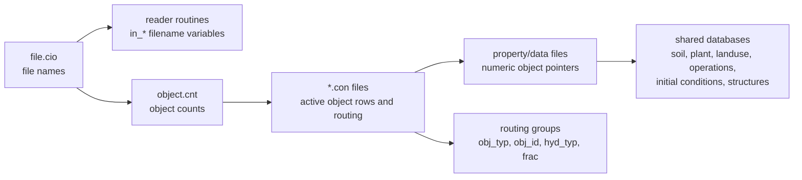
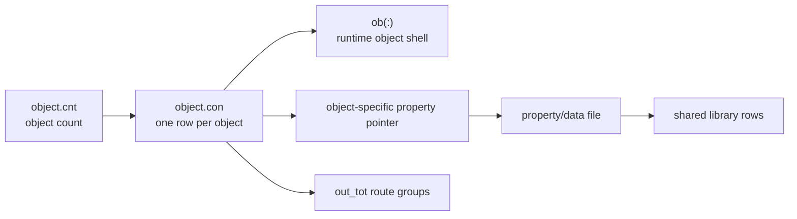

# SWAT+ Input File System

This note explains the general input-file pattern. It does not try to document
every HRU field or every spatial object. For those, use:

- [[02-hru-input-chain]] for HRUs.
- [[03-spatial-object-input-chains]] for non-HRU spatial objects.
- [[04-management-schedule-and-operations]] for `management.sch`.

## Core Model



The main idea is simple: `file.cio` lists filenames, `object.cnt` says which
object families are active, connect files define the individual objects, and
property files point into reusable databases.

## Three Control Layers

| Layer | File | What it controls | What it does not control |
|---|---|---|---|
| File list | [[file.cio]] | Which named input files the legacy readers open. | Whether an object type is active. |
| Object inventory | [[object.cnt]] | How many objects of each family exist. | The properties of any single object. |
| Object connect files | `*.con` files | Individual object rows, object property pointers, weather station names, and routing targets. | The detailed reusable parameters inside databases. |

The common mistake is to treat `file.cio` as the whole input model. It is not.
A file can be listed in `file.cio` while its object count is zero, so that file
may not matter for that run.

## File.cio Registered Files

`readcio_read.f90` reads [[file.cio]] and stores names into derived-type fields
in `input_file_module.f90`, such as `in_con%hru_con`,
`in_hru%hru_data`, `in_lum%management_sch`, and
`in_parmdb%plants_plt`.

A reader controlled by `file.cio` usually opens a variable:

```fortran
inquire (file=in_<category>%<field>, exist=i_exist)
```

Examples:

| Reader | `file.cio` field | Typical file |
|---|---|---|
| [[hyd_connect.f90]] / [[hyd_read_connect.f90]] | `in_con%hru_con`, `in_con%chan_con`, etc. | [[hru.con]], [[channel.con]], [[chandeg.con]] |
| [[soil_db_read.f90]] | `in_sol%soils_sol` | [[soils.sol]] |
| [[plant_parm_read.f90]] | `in_parmdb%plants_plt` | [[plants.plt]] |
| [[mgt_read_mgtops.f90]] | `in_lum%management_sch` | [[management.sch]] |
| [[carbon_bsn_read.f90]] | `in_basin%carbon_bsn` | [[carbon.bsn]] |

## Hardcoded Files

Some readers ignore `file.cio` and open literal filenames. Renaming those files
requires matching the literal name or changing source.

Important hardcoded groups:

| Group | Examples | Notes |
|---|---|---|
| Salt and conservative constituent data | `salt_hru.ini`, `salt_aqu.ini`, `cs_hru.ini`, `cs_aqu.ini`, `salt_channel.ini`, `cs_channel.ini` | The active constituent list still comes from [[constituents.cs]], but many data files are hardcoded. |
| Special management/support files | `puddle.ops`, `transplant.plt`, `manure_om.frt`, `manure_db.frt`, `satbuffer.str` | Read by specific support readers. |
| Recall database | [[recall_db.rec]] | `input_file_module.f90` has a `recall.rec` field, but this source path reads the database from `recall_db.rec`. |
| Carbon companion files | [[carbon_lyr.bsn]], `carbon_layers.prt` | `carbon_lyr.bsn` is derived from the `carbon.bsn` path, not a separate `file.cio` field. |

## Object Pattern

Most hydrologic object families follow this shape:



The eighth connect-file field is usually the object-specific property pointer,
but there are caveats. RU uses local RU number at runtime, recall uses
`ob()%num`, outlet has no separate property database, and GWFLOW/canal/pump
paths are subsystem-specific.

## Object Family Summary

| Family | Source count field / common header | Connect file | Main property path | Details |
|---|---|---|---|---|
| HRU | `sp_ob%hru` / `hru` | [[hru.con]] | [[hru-data.hru]] | See [[02-hru-input-chain]]. |
| HRU-LTE | `sp_ob%hru_lte` / `lhru` | [[hru-lte.con]] | [[hru-lte.hru]] | See [[03-spatial-object-input-chains]]. |
| Routing unit | `sp_ob%ru` / `rtu` | [[rout_unit.con]] | [[rout_unit.rtu]], [[rout_unit.def]], [[rout_unit.ele]] | RU membership and routing group. |
| Aquifer | `sp_ob%aqu` / `aqu` | [[aquifer.con]] | [[aquifer.aqu]] | Aquifer property and initial condition chain. |
| Regular channel | `sp_ob%chan` / `cha` | [[channel.con]] | [[channel.cha]] | Regular channel chain. |
| SWAT-DEG channel | `sp_ob%chandeg` / `lcha` | [[chandeg.con]] | [[channel-lte.cha]], [[hyd-sed-lte.cha]] | SWAT-DEG / simplified channel chain. |
| Reservoir | `sp_ob%res` / `res` | [[reservoir.con]] | [[reservoir.res]] | Reservoir property and release chain. |
| Recall | `sp_ob%recall` / `rec` | [[recall.con]] | [[recall_db.rec]] | External inflow time-series path. |
| Exco | `sp_ob%exco` / `exco` | [[exco.con]] | [[exco.exc]] | Export coefficient transfer path. |
| Delivery ratio | `sp_ob%dr` / `dlr` | [[delratio.con]] | [[delratio.del]] | Delivery-ratio transfer path. |
| Outlet | `sp_ob%outlet` / `out` | [[outlet.con]] | none in normal path | Terminal outlet shell. |
| GWFLOW/canal/pump/aquifer2D/herd/wro | mixed | mixed or no normal connect shell | subsystem support files | Special cases; see [[03-spatial-object-input-chains]]. |

## Functional Comparisons

These comparisons focus on model function after `command.f90` dispatches the
spatial object.

### HRU vs HRU-LTE

| Focus | HRU | HRU-LTE |
|---|---|---|
| Entry routine | `hru_control.f90` | `hru_lte_control.f90` |
| Input path | `hru.con` -> `hru-data.hru` | `hru-lte.con` -> `hru-lte.hru` |
| Function type | Detailed land-phase controller | Compact landscape-unit routine |
| Hydrology | Canopy, snow, runoff, ET, percolation, lateral flow, tile flow | CN runoff, simple snow, PET/AET, lateral/tile/percolation/GW stores |
| Plant and management | Plant community, scheduled operations, grazing, fertilizer, tillage | Decision-table season, simple biomass/LAI, optional irrigation |
| Water quality | Nutrients, carbon, pesticides, pathogens, salts, constituents | Mostly water/sediment/plant; limited placeholders |
| Hydrograph output | Total, recharge, surface, lateral, tile | Mainly total flow/sediment; recharge line commented |
| Key point | Detailed and modular | Faster and simplified |

### Regular Channel vs SWAT-DEG Channel

| Focus | Regular channel | SWAT-DEG channel |
|---|---|---|
| Spatial object | `sp_ob%chan` | `sp_ob%chandeg` |
| Input path | `channel.con` -> `channel.cha` | `chandeg.con` -> `channel-lte.cha` -> `initial.cha`, `hyd-sed-lte.cha`, `nutrients.cha` |
| Entry routine | `channel_control` branch is commented | Active `sd_channel_control3.f90` |
| Main function | Older regular channel input family | Active simplified channel routing and degradation |
| Stored/process data | Hydrology, sediment, nutrients, temperature | Routing, floodplain/wetland exchange, erosion, deposition |
| Special routines | Old control path not active here | `sd_channel_sediment3.f90`, `ch_rtmusk.f90` |
| Hydrograph flow | Three slots defined: total, recharge, overbank | `ob(icmd)%hin` -> `ht1` -> `ht2` -> `ob(icmd)%hd(1)` |
| Key point | Useful for documenting legacy channel files | Use for current routed channel behavior |

## Semantic Roles

The modeling role is separate from the filename-opening mechanism.

| Role | Meaning | Examples |
|---|---|---|
| Control file | Tells SWAT+ what to read or how to run. | [[file.cio]], [[time.sim]], [[print.prt]], [[object.cnt]] |
| Object connect file | Defines active spatial objects and routing targets. | [[hru.con]], [[aquifer.con]], [[channel.con]], [[chandeg.con]] |
| Object property file | Stores the property bundle selected by a connect-file pointer. | [[hru-data.hru]], [[aquifer.aqu]], [[channel.cha]], [[reservoir.res]] |
| Shared database | Reusable parameter rows, not owned by one object. | [[plants.plt]], [[soils.sol]], [[fertilizer.frt]], [[tillage.til]], [[nutrients.sol]] |
| Initialization file | Initial state or initial-condition pointer group. | [[soil_plant.ini]], [[plant.ini]], [[initial.aqu]], [[initial.cha]], [[initial.res]] |
| Operations/management library | Schedules, operations, decision tables, and structures. | [[landuse.lum]], [[management.sch]], `*.ops`, `*.str`, `*.dtl` |
| Time-series forcing | Station-indexed or date-indexed forcing data. | [[pcp.cli]], [[tmp.cli]], [[slr.cli]], [[hmd.cli]], [[wnd.cli]], [[atmodep.cli]] |

## How To Trace Any Input

1. Start with [[file.cio]] to see whether the filename is controlled there.
2. If the file is hardcoded, open the reader and inspect its `inquire` line.
3. Check [[object.cnt]] to see whether the object family is active.
4. Open the relevant connect file and find the object row by `id` or `name`.
5. Follow the object-specific property pointer into the property/data file.
6. Follow text names from the property file into shared databases.
7. Follow `out_tot` routing groups to see where hydrographs go.
8. For HRUs, expand `lu_mgt` using [[02-hru-input-chain]].
9. For management schedules, use [[04-management-schedule-and-operations]].

## Related

- [[02-hru-input-chain]] - detailed HRU input chain.
- [[03-spatial-object-input-chains]] - non-HRU spatial object chains.
- [[04-management-schedule-and-operations]] - management schedule and operation execution.
- [[file.cio]] - field-by-field control-file map.
- [[object.cnt]] - basin object inventory.
- [[readcio_read.f90]] - parser for `file.cio`.
- [[hyd_connect.f90]] - builds object connectivity and routing.
