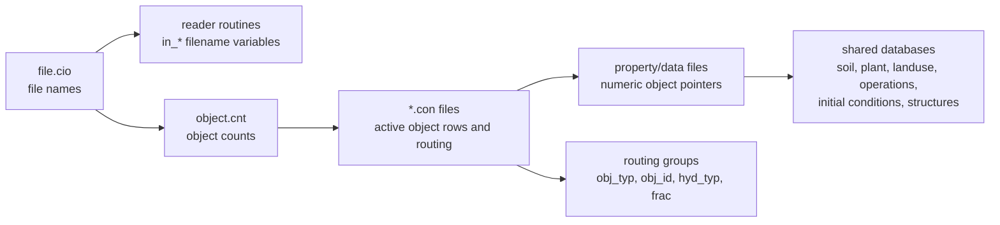
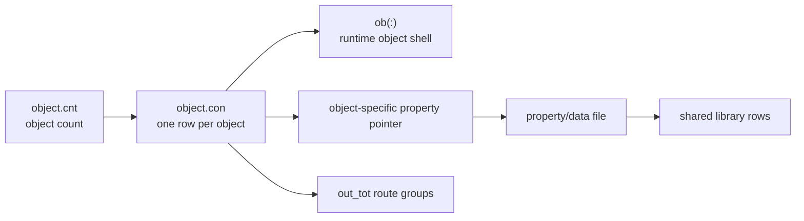

# SWAT+ Input File System

This note explains the general input-file pattern. It does not try to document
every HRU field or every spatial object. For those, use:

- [[02-hru-input-chain]] for HRUs.
- [[03-spatial-object-input-chains]] for non-HRU spatial objects.
- [[04-management-schedule-and-operations]] for `management.sch`.

## Core Model



The main idea is simple: `file.cio` lists filenames, `object.cnt` says which
object families are active, connect files define the individual objects, and
property files point into reusable databases.

## Three Control Layers

| Layer | File | What it controls | What it does not control |
|---|---|---|---|
| File list | [[file.cio]] | Which named input files the legacy readers open. | Whether an object type is active. |
| Object inventory | [[object.cnt]] | How many objects of each family exist. | The properties of any single object. |
| Object connect files | `*.con` files | Individual object rows, object property pointers, weather station names, and routing targets. | The detailed reusable parameters inside databases. |

The common mistake is to treat `file.cio` as the whole input model. It is not.
A file can be listed in `file.cio` while its object count is zero, so that file
may not matter for that run.

## File.cio Registered Files

`readcio_read.f90` reads [[file.cio]] and stores names into derived-type fields
in `input_file_module.f90`, such as `in_con%hru_con`,
`in_hru%hru_data`, `in_lum%management_sch`, and
`in_parmdb%plants_plt`.

A reader controlled by `file.cio` usually opens a variable:

```fortran
inquire (file=in_<category>%<field>, exist=i_exist)
```

Examples:

| Reader | `file.cio` field | Typical file |
|---|---|---|
| [[hyd_connect.f90]] / [[hyd_read_connect.f90]] | `in_con%hru_con`, `in_con%chan_con`, etc. | [[hru.con]], [[channel.con]], [[chandeg.con]] |
| [[soil_db_read.f90]] | `in_sol%soils_sol` | [[soils.sol]] |
| [[plant_parm_read.f90]] | `in_parmdb%plants_plt` | [[plants.plt]] |
| [[mgt_read_mgtops.f90]] | `in_lum%management_sch` | [[management.sch]] |
| [[carbon_bsn_read.f90]] | `in_basin%carbon_bsn` | [[carbon.bsn]] |

## Hardcoded Files

Some readers ignore `file.cio` and open literal filenames, module-default names,
or derived companion names instead. Renaming those files requires matching the
literal, changing the module default, or editing source.

### Recognizing The Open Mechanism

| Class | How to recognize it | Rename rule |
|---|---|---|
| `file.cio` registered | reader opens `in_<category>%<field>` | edit [[file.cio]] |
| hardcoded literal | reader opens `'name'` or `"name"` | edit source or keep the expected filename |
| module default | reader opens a module variable with a default literal not populated by `file.cio` | change the module default or provide the default file |
| derived companion | reader derives a second filename from a `file.cio` file | rename using the same derivation rule |
| data-driven child | parent control file stores child filenames read at runtime | keep in the parent file's structure; do not generate a standalone note from the runtime expression |

### Hardcoded File Groups (summary)

| Group | Examples | Notes |
|---|---|---|
| Salt and conservative constituent data | `salt_hru.ini`, `salt_aqu.ini`, `cs_hru.ini`, `cs_aqu.ini`, `salt_channel.ini`, `cs_channel.ini` | The active constituent list still comes from [[constituents.cs]], but many data files are hardcoded. |
| Special management/support files | `puddle.ops`, `transplant.plt`, `manure_om.frt`, `manure_db.frt`, `satbuffer.str` | Read by specific support readers. |
| Recall database | [[recall_db.rec]] | `input_file_module.f90` has a `recall.rec` field, but this source path reads the database from `recall_db.rec`. |
| Carbon companion files | [[carbon_lyr.bsn]], `carbon_layers.prt` | `carbon_lyr.bsn` is derived from the `carbon.bsn` path, not a separate `file.cio` field. |

### Detailed File -> Reader Map

Core scattered files opened by literal or default names:

| File | Reader | Call area | Notes |
|---|---|---|---|
| [[file.cio]] | [[readcio_read.f90]] | [[proc_bsn.f90]] | master control file; intentionally hardcoded as the root input |
| [[co2_yr.dat]] | [[co2_read.f90]] | [[proc_bsn.f90]] | atmospheric CO2 input, optional if present |
| [[carbon_layers.prt]] | [[carbon_layers_read.f90]] | [[proc_bsn.f90]] | carbon output-layer print controls |
| [[carbon_lyr.bsn]] | [[carbon_bsn_read.f90]] | [[proc_bsn.f90]] | derived companion to [[carbon.bsn]], not a direct `file.cio` entry |
| [[pest_metabolite.pes]] | [[pest_metabolite_read.f90]] | [[proc_read.f90]] | pesticide metabolite definitions |
| [[manure_om.frt]] | [[manure_orgmin_read.f90]] | [[proc_db.f90]] | manure organic/mineral nutrient definitions |
| [[manure_db.frt]] | [[manure_db_read.f90]] | [[proc_db.f90]] | extended manure database records |
| [[transplant.plt]] | [[plant_transplant_read.f90]] | [[proc_db.f90]] | plant transplanting data |
| [[puddle.ops]] | [[mgt_read_puddle.f90]] | [[proc_db.f90]] | puddling/paddy management operation data |
| [[satbuffer.str]] | [[sat_buff_read.f90]] | [[proc_db.f90]] | saturated-buffer structural connections |
| [[shade_factor.shf]] | [[shade_factor_read.f90]] | [[proc_read.f90]] | default module filename in `in_shf`, not listed in `file.cio` |

Salt and constituent transport. These are the main `rtb salt` and `rtb cs` files
opened by literal names; `constituents.cs` stays `file.cio`-registered and
controls which constituents exist:

| File | Reader | Role |
|---|---|---|
| [[salt_hru.ini]] | [[salt_hru_read.f90]] | HRU salt initialization |
| [[salt_aqu.ini]] | [[salt_aqu_read.f90]] | aquifer salt initialization |
| [[salt_irrigation]] | [[salt_irr_read.f90]] | irrigation salt parameters |
| [[salt_plants]] | [[salt_plant_read.f90]] | plant salt parameters |
| [[salt_atmo.cli]] | [[cli_read_atmodep_salt.f90]] | atmospheric salt deposition |
| [[salt_road]] | [[salt_roadsalt_read.f90]] | road salt application |
| [[salt_uptake]] | [[salt_uptake_read.f90]] | salt uptake coefficients |
| [[salt_urban]] | [[salt_urban_read.f90]] | urban salt parameters |
| [[salt_fertilizer.frt]] | [[salt_fert_read.f90]] | fertilizer salt content |
| [[salt_channel.ini]] | [[salt_cha_read.f90]] | channel salt initialization |
| [[salt_res]] | [[res_read_saltdb.f90]] | reservoir salt inputs |
| [[cs_hru.ini]] | [[cs_hru_read.f90]] | HRU constituent initialization |
| [[cs_aqu.ini]] | [[cs_aqu_read.f90]] | aquifer constituent initialization |
| [[cs_atmo.cli]] | [[cli_read_atmodep_cs.f90]] | atmospheric constituent deposition |
| [[cs_irrigation]] | [[cs_irr_read.f90]] | irrigation constituent parameters |
| [[cs_plants_boron]] | [[cs_plant_read.f90]] | plant boron/constituent parameters |
| [[cs_uptake]] | [[cs_uptake_read.f90]] | constituent uptake coefficients |
| [[cs_reactions]] | [[cs_reactions_read.f90]] | reaction parameters |
| [[cs_urban]] | [[cs_urban_read.f90]] | urban constituent parameters |
| [[fertilizer.frt_cs]] | [[cs_fert_read.f90]] | fertilizer constituent content |
| [[cs_channel.ini]] | [[cs_cha_read.f90]] | channel constituent initialization |
| [[cs_streamobs]] | [[cs_cha_read.f90]] | channel constituent observation setup |
| [[cs_res]] | [[res_read_csdb.f90]] | reservoir constituent inputs |

Recall and time-series companion files. The individual time-series filenames
inside recall records are data values read from these control files, not
standalone files to generate notes for:

| File | Reader | Notes |
|---|---|---|
| [[recall_db.rec]] | [[recall_read.f90]] | hardcoded root recall database opened by `recalldb_read` |
| [[pest.com]] | [[recall_read.f90]] | hardcoded pesticide recall companion |
| [[cs_recall.rec]] | [[recall_read_cs.f90]] | hardcoded constituent recall control |
| [[salt_recall.rec]] | [[recall_read_salt.f90]] | hardcoded salt recall control |

Water allocation files:

| File | Reader | Notes |
|---|---|---|
| [[outside_rcv.wal]] | [[water_orcv_read.f90]] | outside receiving objects |
| `outside_src.wal` / [[out_src.wal]] | [[water_osrc_read.f90]] | source inquires `outside_src.wal` but opens `out_src.wal`; verify before changing |
| [[water_treat.wal]] | [[water_treatment_read.f90]] | treatment definitions |
| [[water_use.wal]] | [[water_use_read.f90]] | water use definitions |
| [[water_tower.wal]] | [[water_tower_read.f90]] | tower definitions |
| [[water_pipe.wal]] | [[water_pipe_read.f90]] | pipe definitions |
| [[water_canal.wal]] | [[water_canal_read.f90]] | canal definitions |
| [[om_treat.wal]] | [[om_treat_read.f90]] | organic/mineral treatment definitions |
| [[om_use.wal]] | [[om_use_read.f90]] | organic/mineral use definitions |
| [[om_osrc.wal]] | [[om_osrc_read.f90]] | organic/mineral outside source definitions |

Groundwater and optional subsystems: the `gwflow` subsystem has many literal
filenames (`codes.gw`, `cells.gw`, `zones.gw`, `cellcon.gw`, `outputs.gw`,
`hrucell.gw`, `lsucell.gw`, `chancell.gw`, `chan_depth.gw`, and related files) —
treat these as a subsystem-specific input set; `file.cio` renames do not affect
them. Other optional literal inputs include calibration/update helpers such as
[[scen_dtl.upd]], channel/reservoir constituent helpers such as
[[initial.cha_cs]] and [[reservoir.res_cs]], and legacy/specialized files such as
[[sed_nut.cha]] and [[soil_lyr_depths.sol]].

### Maintaining This Map

When a new reader is studied, classify its file-opening mechanism:

1. `in_<category>%<field>`: update [[file.cio]] and the relevant input-file note.
2. Literal string: add it to the tables above and mark the source routine note.
3. Derived filename: document the derivation rule and the controlling input.
4. Data-driven child filename: keep it in the parent file's structure; do not create a fake note from the runtime expression.

Provenance: the literal/default filenames above were collected by grepping
`file=` literals in `SWATPLUS/swatplus/src` and cross-checking against the
input-file readers.

## Object Pattern

Most hydrologic object families follow this shape:



The eighth connect-file field is usually the object-specific property pointer,
but there are caveats. RU uses local RU number at runtime, recall uses
`ob()%num`, outlet has no separate property database, and GWFLOW/canal/pump
paths are subsystem-specific.

## Object Family Summary

| Family | Source count field / common header | Connect file | Main property path | Details |
|---|---|---|---|---|
| HRU | `sp_ob%hru` / `hru` | [[hru.con]] | [[hru-data.hru]] | See [[02-hru-input-chain]]. |
| HRU-LTE | `sp_ob%hru_lte` / `lhru` | [[hru-lte.con]] | [[hru-lte.hru]] | See [[03-spatial-object-input-chains]]. |
| Routing unit | `sp_ob%ru` / `rtu` | [[rout_unit.con]] | [[rout_unit.rtu]], [[rout_unit.def]], [[rout_unit.ele]] | RU membership and routing group. |
| Aquifer | `sp_ob%aqu` / `aqu` | [[aquifer.con]] | [[aquifer.aqu]] | Aquifer property and initial condition chain. |
| Regular channel | `sp_ob%chan` / `cha` | [[channel.con]] | [[channel.cha]] | Regular channel chain. |
| SWAT-DEG channel | `sp_ob%chandeg` / `lcha` | [[chandeg.con]] | [[channel-lte.cha]], [[hyd-sed-lte.cha]] | SWAT-DEG / simplified channel chain. |
| Reservoir | `sp_ob%res` / `res` | [[reservoir.con]] | [[reservoir.res]] | Reservoir property and release chain. |
| Recall | `sp_ob%recall` / `rec` | [[recall.con]] | [[recall_db.rec]] | External inflow time-series path. |
| Exco | `sp_ob%exco` / `exco` | [[exco.con]] | [[exco.exc]] | Export coefficient transfer path. |
| Delivery ratio | `sp_ob%dr` / `dlr` | [[delratio.con]] | [[delratio.del]] | Delivery-ratio transfer path. |
| Outlet | `sp_ob%outlet` / `out` | [[outlet.con]] | none in normal path | Terminal outlet shell. |
| GWFLOW/canal/pump/aquifer2D/herd/wro | mixed | mixed or no normal connect shell | subsystem support files | Special cases; see [[03-spatial-object-input-chains]]. |

## Functional Comparisons

These comparisons focus on model function after `command.f90` dispatches the
spatial object.

### HRU vs HRU-LTE

| Focus | HRU | HRU-LTE |
|---|---|---|
| Entry routine | `hru_control.f90` | `hru_lte_control.f90` |
| Input path | `hru.con` -> `hru-data.hru` | `hru-lte.con` -> `hru-lte.hru` |
| Function type | Detailed land-phase controller | Compact landscape-unit routine |
| Hydrology | Canopy, snow, runoff, ET, percolation, lateral flow, tile flow | CN runoff, simple snow, PET/AET, lateral/tile/percolation/GW stores |
| Plant and management | Plant community, scheduled operations, grazing, fertilizer, tillage | Decision-table season, simple biomass/LAI, optional irrigation |
| Water quality | Nutrients, carbon, pesticides, pathogens, salts, constituents | Mostly water/sediment/plant; limited placeholders |
| Hydrograph output | Total, recharge, surface, lateral, tile | Mainly total flow/sediment; recharge line commented |
| Key point | Detailed and modular | Faster and simplified |

### Regular Channel vs SWAT-DEG Channel

| Focus               | Regular channel                                | SWAT-DEG channel                                                                        |
| ------------------- | ---------------------------------------------- | --------------------------------------------------------------------------------------- |
| Spatial object      | `sp_ob%chan`                                   | `sp_ob%chandeg`                                                                         |
| Input path          | `channel.con` -> `channel.cha`                 | `chandeg.con` -> `channel-lte.cha` -> `initial.cha`, `hyd-sed-lte.cha`, `nutrients.cha` |
| Entry routine       | `channel_control` branch is commented          | Active `sd_channel_control3.f90`                                                        |
| Main function       | Older regular channel input family             | Active simplified channel routing and degradation                                       |
| Stored/process data | Hydrology, sediment, nutrients, temperature    | Routing, floodplain/wetland exchange, erosion, deposition                               |
| Special routines    | Old control path not active here               | `sd_channel_sediment3.f90`, `ch_rtmusk.f90`                                             |
| Hydrograph flow     | Three slots defined: total, recharge, overbank | `ob(icmd)%hin` -> `ht1` -> `ht2` -> `ob(icmd)%hd(1)`                                    |
| Key point           | Useful for documenting legacy channel files    | Use for current routed channel behavior                                                 |

## Semantic Roles

The modeling role is separate from the filename-opening mechanism.

| Role | Meaning | Examples |
|---|---|---|
| Control file | Tells SWAT+ what to read or how to run. | [[file.cio]], [[time.sim]], [[print.prt]], [[object.cnt]] |
| Object connect file | Defines active spatial objects and routing targets. | [[hru.con]], [[aquifer.con]], [[channel.con]], [[chandeg.con]] |
| Object property file | Stores the property bundle selected by a connect-file pointer. | [[hru-data.hru]], [[aquifer.aqu]], [[channel.cha]], [[reservoir.res]] |
| Shared database | Reusable parameter rows, not owned by one object. | [[plants.plt]], [[soils.sol]], [[fertilizer.frt]], [[tillage.til]], [[nutrients.sol]] |
| Initialization file | Initial state or initial-condition pointer group. | [[soil_plant.ini]], [[plant.ini]], [[initial.aqu]], [[initial.cha]], [[initial.res]] |
| Operations/management library | Schedules, operations, decision tables, and structures. | [[landuse.lum]], [[management.sch]], `*.ops`, `*.str`, `*.dtl` |
| Time-series forcing | Station-indexed or date-indexed forcing data. | [[pcp.cli]], [[tmp.cli]], [[slr.cli]], [[hmd.cli]], [[wnd.cli]], [[atmodep.cli]] |

## How To Trace Any Input

1. Start with [[file.cio]] to see whether the filename is controlled there.
2. If the file is hardcoded, open the reader and inspect its `inquire` line.
3. Check [[object.cnt]] to see whether the object family is active.
4. Open the relevant connect file and find the object row by `id` or `name`.
5. Follow the object-specific property pointer into the property/data file.
6. Follow text names from the property file into shared databases.
7. Follow `out_tot` routing groups to see where hydrographs go.
8. For HRUs, expand `lu_mgt` using [[02-hru-input-chain]].
9. For management schedules, use [[04-management-schedule-and-operations]].

## Related

- [[02-hru-input-chain]] - detailed HRU input chain.
- [[03-spatial-object-input-chains]] - non-HRU spatial object chains.
- [[04-management-schedule-and-operations]] - management schedule and operation execution.
- [[file.cio]] - field-by-field control-file map.
- [[object.cnt]] - basin object inventory.
- [[readcio_read.f90]] - parser for `file.cio`.
- [[hyd_connect.f90]] - builds object connectivity and routing.
