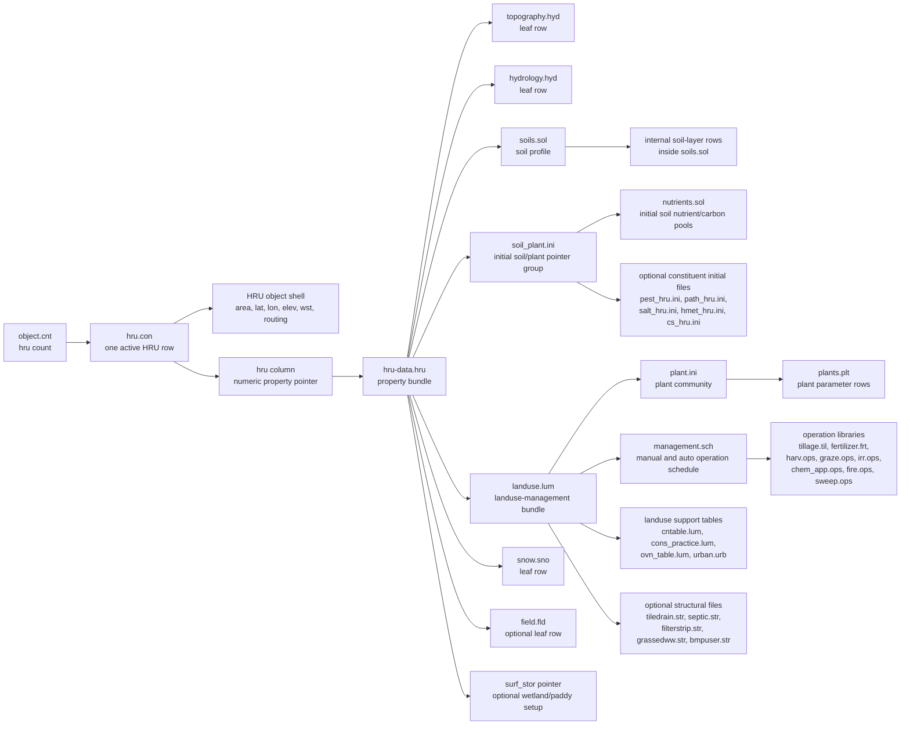
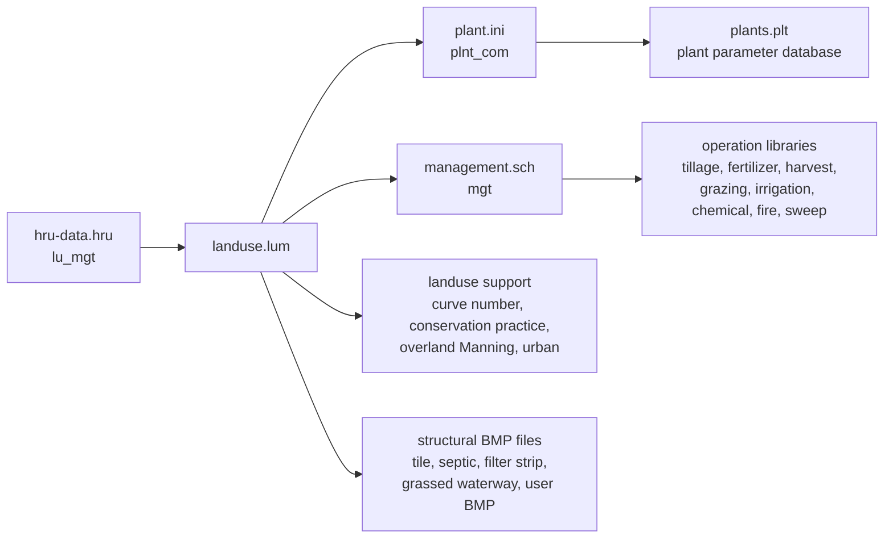

# HRU Input Chain

The HRU is the most complex spatial object because one `hru.con` row expands
through soil, plant community, landuse, management, initial soil nutrient and
carbon pools, optional surface storage, snow, field, and structural files.

Use [[01-input-file-system]] for the general rules and
[[04-management-schedule-and-operations]] for the detailed operation schedule.

## Full HRU Flow



In this diagram, "leaf row" means the row supplies parameters directly and does
not point to another main HRU input file. `soils.sol` is different: the selected
soil profile has internal layer rows inside the same file. `soil_plant.ini` and
`landuse.lum` are true pointer groups that expand to additional files.

## Exact Pointer Table

| Step | File | Key field | Meaning |
|---:|---|---|---|
| 1 | [[object.cnt]] | `hru` | Number of HRU rows expected in [[hru.con]]. |
| 2 | [[hru.con]] | `id`, `name`, `area`, `lat`, `lon`, `elev` | The active HRU object row. |
| 3 | [[hru.con]] | `hru` | Numeric property pointer stored as `ob(i)%props`; selects a row in [[hru-data.hru]]. |
| 4 | [[hru.con]] | `wst` | Weather station pointer. |
| 5 | [[hru.con]] | `out_tot` and route groups | Optional routing targets. |
| 6 | [[hru-data.hru]] | `topo` | Text pointer to [[topography.hyd]]. |
| 7 | [[hru-data.hru]] | `hydro` | Text pointer to [[hydrology.hyd]]. |
| 8 | [[hru-data.hru]] | `soil` | Text pointer to [[soils.sol]]; selected profile contains internal layers. |
| 9 | [[hru-data.hru]] | `lu_mgt` | Text pointer to [[landuse.lum]]. |
| 10 | [[hru-data.hru]] | `soil_plant_init` | Text pointer to [[soil_plant.ini]]. |
| 11 | [[hru-data.hru]] | `surf_stor`, `snow`, `field` | Optional surface storage, snow, and field records. |

## Landuse, Plant, And Management

The `lu_mgt` field is the most important HRU expansion point.



Roles:

| File                            | HRU role                                                                                          |
| ------------------------------- | ------------------------------------------------------------------------------------------------- |
| [[landuse.lum]]                 | Landuse-management bundle selected by `hru-data.hru` `lu_mgt`.                                    |
| [[plant.ini]]                   | Plant community initialization selected by `landuse.lum` `plnt_com`.                              |
| [[plants.plt]]                  | Shared plant parameter database; plants become active only through the HRU plant-community chain. |
| [[management.sch]]              | Manual and auto operation schedule selected by `landuse.lum` `mgt`.                               |
| `*.ops` and parameter databases | Operation definitions referenced by operation rows in `management.sch`.                           |
| `*.str` files                   | Optional structural BMP definitions referenced by `landuse.lum`.                                  |

## Soil And Initial Nutrient/Carbon State

`soils.sol` and `soil_plant.ini` are separate concepts.

| Chain | What it supplies |
|---|---|
| [[soils.sol]] | Soil profile and internal layer physical properties such as depth, bulk density, available water capacity, conductivity, carbon, texture fractions, and pH. |
| [[soil_plant.ini]] -> [[nutrients.sol]] | Initial soil water fraction, plant community state, and initial nutrient/carbon pools used by `soil_nutcarb_init.f90`. |
| Optional initial files | Initial pesticide, pathogen, salt, heavy metal, and conservative constituent states when those modules are active. |

Soil layers are not a separate child input file under `topography.hyd` or
`hydrology.hyd`. They are rows inside the selected `soils.sol` profile.

## Ames_sub1 Example

`Ames_sub1/object.cnt` has `hru=12`, so all active counted objects are HRUs.
The first `hru.con` row is:

```text
1 hru0001 1 1.005 41.20 -96.63 347.5 1 wgn_01 0 0 0 0
```

Read it as:

| Field | Value | Meaning |
|---|---|---|
| `id` | `1` | HRU object number. |
| `area` | `1.005` | HRU area in hectares. |
| `hru` | `1` | Selects row 1 in [[hru-data.hru]]. |
| `wst` | `wgn_01` | Weather station pointer. |
| `out_tot` | `0` | No outgoing route groups on this row. |

Row 1 in `hru-data.hru`:

```text
1 hru0001 topohru0001 hyd0001 soil_01-h1 cosy_lum soilplant1 null snow001 null
```

That row connects HRU 1 to:

| Pointer | Value | Target |
|---|---|---|
| `topo` | `topohru0001` | [[topography.hyd]] |
| `hydro` | `hyd0001` | [[hydrology.hyd]] |
| `soil` | `soil_01-h1` | [[soils.sol]] |
| `lu_mgt` | `cosy_lum` | [[landuse.lum]] |
| `soil_plant_init` | `soilplant1` | [[soil_plant.ini]] |
| `snow` | `snow001` | [[snow.sno]] |

In `landuse.lum`, `cosy_lum` points to `cosy_comm` in [[plant.ini]] and
`mgt_01` in [[management.sch]].

## Osu_1hru Example

`Osu_1hru/object.cnt` has one HRU. Its `hru-data.hru` row is:

```text
1 hru0001 topohru0001 hyd0001 PadHOEGOG rice140_lum soilplant1 paddy0001 snow001 null
```

Key differences from Ames:

| Pointer | Osu value | Meaning |
|---|---|---|
| `soil` | `PadHOEGOG` | Different selected soil profile. |
| `lu_mgt` | `rice140_lum` | Rice landuse-management chain. |
| `surf_stor` | `paddy0001` | Paddy/wetland surface-storage setup. |
| `snow` | `snow001` | Snow parameter row. |

## Source Routine Anchors

- [[hyd_connect.f90]] and [[hyd_read_connect.f90]] read [[hru.con]] into `ob(:)`.
- [[hru_read.f90]] resolves `hru-data.hru` pointers to topography, hydrology,
  soil, landuse, soil/plant initialization, snow, field, and surface storage.
- [[soil_db_read.f90]] reads [[soils.sol]] and its internal layers.
- [[soil_plant_init.f90]] reads [[soil_plant.ini]].
- [[soil_nutcarb_init.f90]] initializes soil nutrient and carbon pools.
- [[hru_lum_init.f90]] initializes landuse, plant community, management, and structural settings.

## Related

- [[01-input-file-system]] - general input-file rules.
- [[03-spatial-object-input-chains]] - non-HRU spatial objects.
- [[04-management-schedule-and-operations]] - management schedule details.
- [[management.sch]] - generated field map for the management schedule input file.
