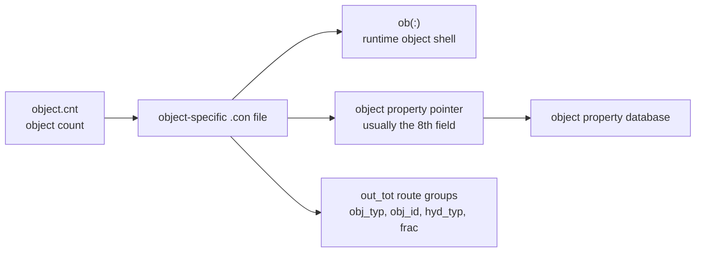
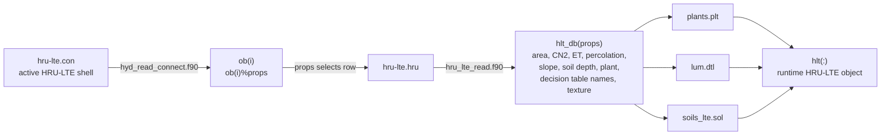
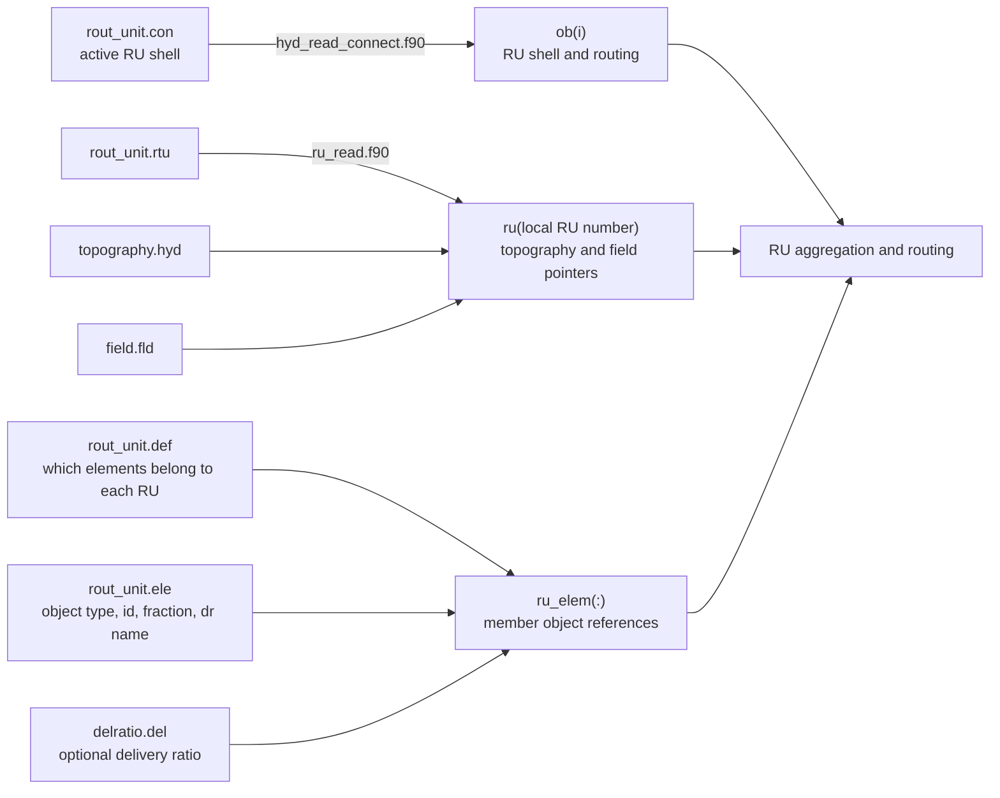
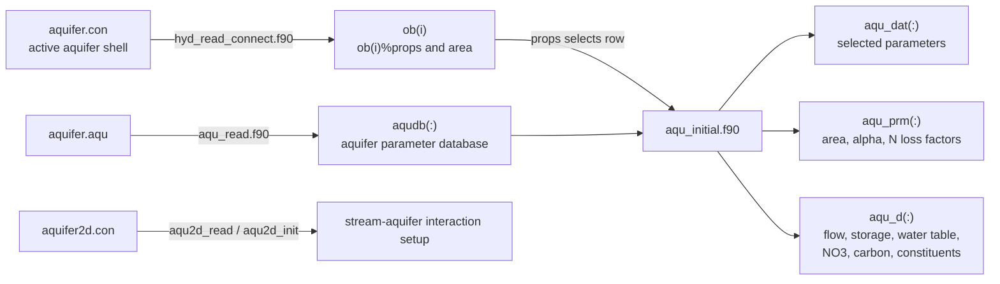
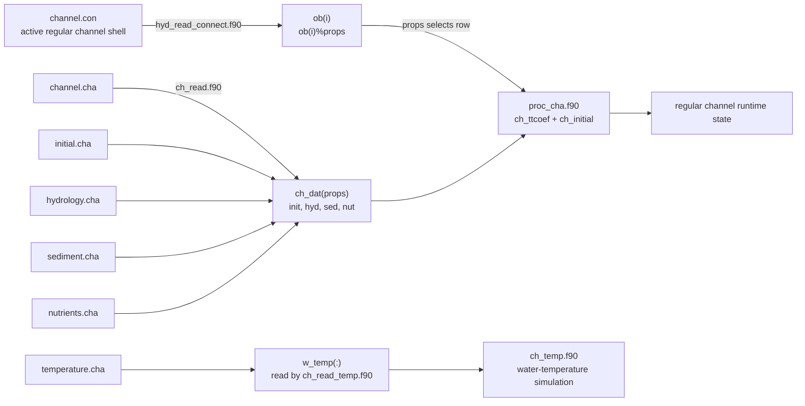
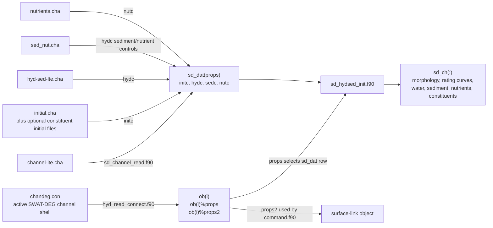
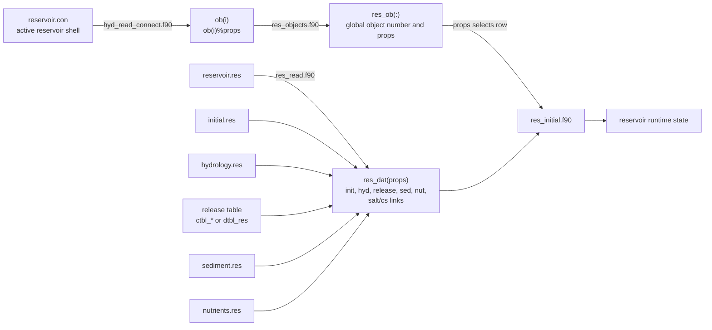
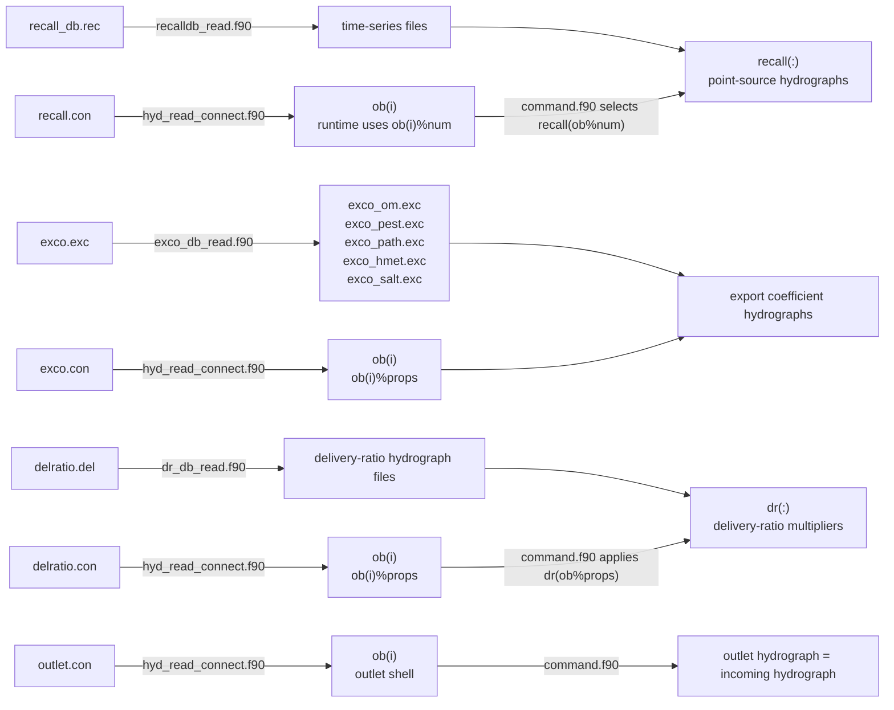
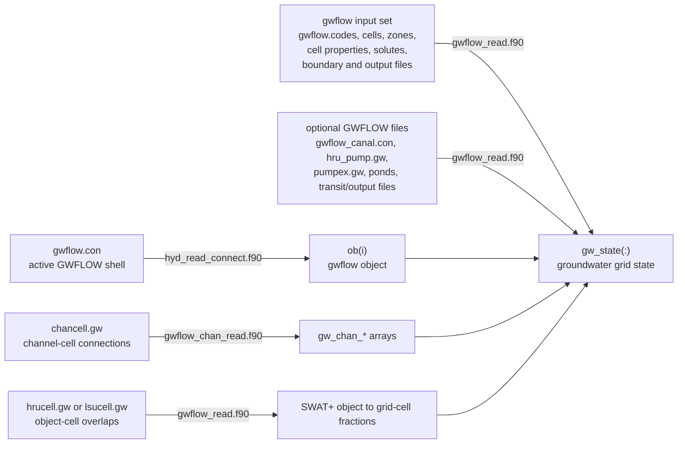
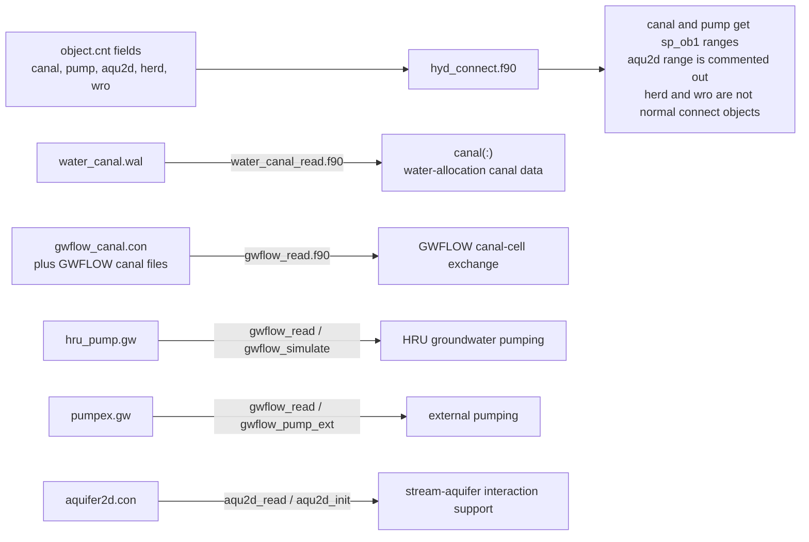

# Spatial Object Input Chains

This note covers the non-HRU object families. Use [[02-hru-input-chain]] for
the HRU, because the HRU has its own soil, plant, landuse, and management
subtree.

## Common Connect Shell

Most spatial objects start with the same connect-file shell:

This pattern is useful, but not universal. RU, recall, outlet, GWFLOW, canal,
pump, aquifer2D, herd, and water rights have special behavior.

## Object Summary

| `object.cnt` field | Runtime object type | Output-link keyword | Connect file | Main property path |
|---|---|---|---|---|
| `sp_ob%hru_lte` | `hru_lte` | `hlt` | [[hru-lte.con]] | `ob()%props` selects [[hru-lte.hru]], which crosswalks to [[plants.plt]], [[lum.dtl]], and [[soils_lte.sol]]. |
| `sp_ob%ru` | `ru` | `ru` | [[rout_unit.con]] | [[rout_unit.rtu]] fills `ru(:)` by local RU number; [[rout_unit.def]] and [[rout_unit.ele]] define members. |
| `sp_ob%gwflow` | `gwflow` | `gwflow` | [[gwflow.con]] | `gwflow_read.f90` reads grid, cell, HRU/LSU-cell, channel-cell, canal, pump, pond, transit, and output files. |
| `sp_ob%aqu` | `aqu` | `aqu` | [[aquifer.con]] | `ob()%props` selects [[aquifer.aqu]] and initializes aquifer state. |
| `sp_ob%chan` | `chan` | `cha` | [[channel.con]] | `ob()%props` selects [[channel.cha]], which crosswalks to channel initialization, hydrology, sediment, and nutrient databases. |
| `sp_ob%res` | `res` | `res` | [[reservoir.con]] | `ob()%props` selects [[reservoir.res]], which crosswalks to initial, hydrology, release, sediment, nutrient, salt, and constituent databases. |
| `sp_ob%recall` | `recall` | `recall` | [[recall.con]] | Runtime command uses `ob()%num`; [[recall_db.rec]] names time-series files. |
| `sp_ob%exco` | `exco` | `exc` | [[exco.con]] | `ob()%props` selects [[exco.exc]] and optional transfer hydrographs. |
| `sp_ob%dr` | `dr` | `dr` | [[delratio.con]] | `ob()%props` selects [[delratio.del]] and optional ratio hydrographs. |
| `sp_ob%outlet` | `outlet` | `out` | [[outlet.con]] | No separate property database in this path. |
| `sp_ob%chandeg` | `chandeg` | `sdc` | [[chandeg.con]] | `ob()%props` selects [[channel-lte.cha]], which crosswalks to [[initial.cha]], [[hyd-sed-lte.cha]], [[sed_nut.cha]], and [[nutrients.cha]]. |
| `sp_ob%canal` | special | water-allocation object | none through `hyd_read_connect` here | Count range exists, but canal data are read through [[water_canal.wal]] and GWFLOW canal files. |
| `sp_ob%pump` | special | water-allocation conveyance | none through `hyd_read_connect` here | Pump behavior is handled through water-allocation transfer logic and GWFLOW pump files such as [[hru_pump.gw]] and [[pumpex.gw]]. |
| `sp_ob%aqu2d` | support path | none | [[aquifer2d.con]] | `aqu2d_read` and `aqu2d_init` are called from aquifer/channel setup; it is not a normal active command object here. |
| `sp_ob%herd`, `sp_ob%wro` | not normal connect objects | none | none in `hyd_connect.f90` | Count fields exist, but no normal spatial-object connect path is used here. |

## HRU-LTE

## Routing Unit

Routing units group member objects, often HRUs, and route the combined
hydrographs downstream.

Important caveat: in this source branch `rout_unit.rtu` fills `ru(:)` by local
RU number rather than through a separate `ru_db(props)` array. Keep the RU
connect row and `rout_unit.rtu` row order aligned.

## Aquifer

## Regular Channel

`temperature.cha` is read through the channel file group, but it is not a text
pointer inside `channel.cha`.

## SWAT-DEG Channel

SWAT-DEG channels use output-link keyword `sdc`.

Read the SWAT-DEG chain as a two-step lookup:

| Step | File / field | Runtime result | Meaning |
|---|---|---|---|
| 1 | [[chandeg.con]] field `lcha` | `ob(i)%props` | Selects one row in [[channel-lte.cha]]. |
| 2 | [[channel-lte.cha]] field `cha_ini` | `sd_dat(props)%init` | Selects an initial-condition row in [[initial.cha]]. |
| 3 | [[channel-lte.cha]] field `cha_hyd` | `sd_dat(props)%hyd` | Selects geometry and hydrology/sediment parameters in [[hyd-sed-lte.cha]]. |
| 4 | [[channel-lte.cha]] field `cha_nut` | `sd_dat(props)%nut` | Selects water-quality coefficients in [[nutrients.cha]]. |

In the current source path, [[channel-lte.cha]] field `cha_sed` is read into
`sd_dat()%sedc`, but the optional [[sed_nut.cha]] lookup is matched by
`cha_hyd` / `sd_dat()%hydc` in `sd_channel_read.f90`.

## Reservoir

## Recall, Exco, Delivery Ratio, Outlet

## GWFLOW

GWFLOW is more like a grid subsystem attached to SWAT+ objects than a simple
single-row property database.

## Canal, Pump, Aquifer2D, Herd, Water Rights

These fields appear in `object.cnt`, but they are not equivalent to the normal
`*.con -> hyd_read_connect -> ob()%props -> property database` pattern.

## Source Routine Anchors

- [[object.cnt]] is read by [[basin_read_objs.f90]].
- [[hyd_connect.f90]] assigns object ranges and calls [[hyd_read_connect.f90]].
- [[command.f90]] executes routed objects during simulation.
- [[proc_cha.f90]], [[proc_aqu.f90]], and [[proc_res.f90]] initialize channel,
  aquifer, and reservoir data.
- [[ru_read.f90]] and [[ru_read_elements.f90]] initialize routing units.
- [[gwflow_read.f90]] initializes GWFLOW grid inputs.

## Related

- [[01-input-file-system]] - general input-file rules.
- [[02-hru-input-chain]] - HRU-specific input chain.
- [[04-management-schedule-and-operations]] - management schedules and operations.
