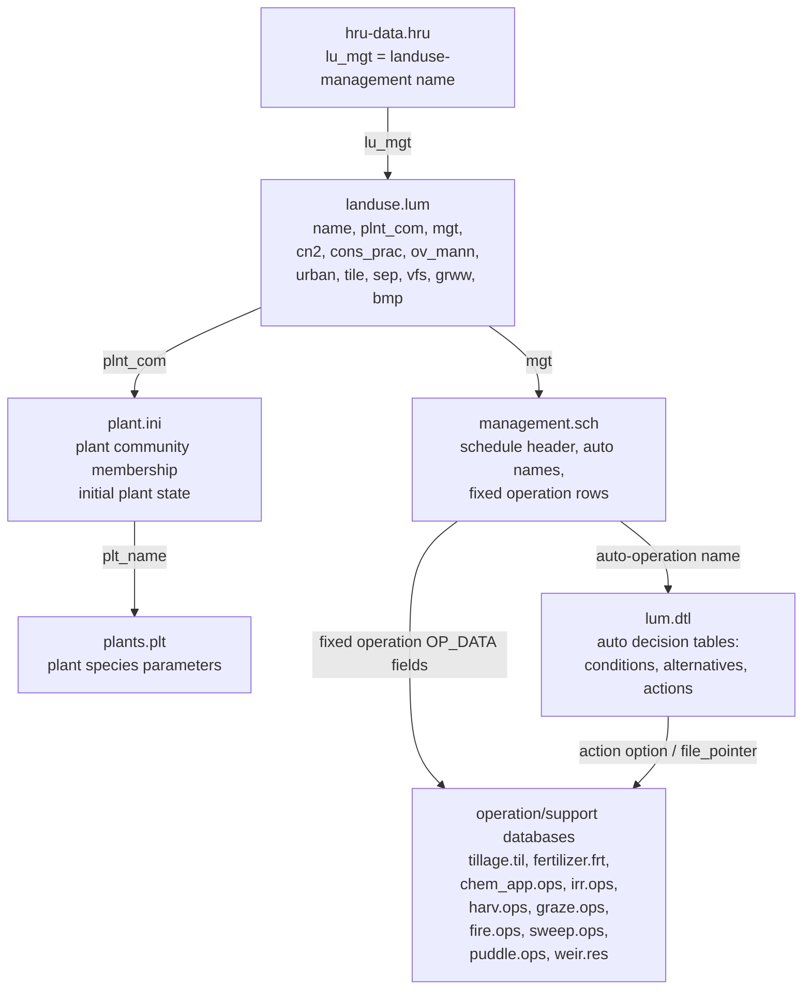

# Management Schedule And Operations

This note explains management from the input files first. The detailed field
maps for each file are in `docs/SWATPLUS/03-input-files/`; this page connects
those files into one HRU management workflow and uses `Ames_sub1` and
`Osu_1hru` as worked examples. Source routine names are kept only as a short
check list at the end.

The main idea is:

```text
hru-data.hru lu_mgt
  -> landuse.lum name
       -> plant community in plant.ini
       -> management schedule in management.sch
       -> other landuse-management parameter tables
            -> fixed operation rows use operation databases
            -> auto operation names use lum.dtl decision tables
```

## Fixed And Auto Management

SWAT+ has two management mechanisms:

| Mechanism | Where you see it in input files | What it means |
|---|---|---|
| Fixed scheduled operations | Rows in [[management.sch]] after the auto-operation names | Do this operation on a calendar date or heat-unit trigger. Examples: plant corn, till with `chisplow`, irrigate with `sprinkler_ilm`, apply fertilizer, harvest. |
| Auto operations | Names listed near the top of each [[management.sch]] schedule | The row is only a pointer to a decision table in [[lum.dtl]]. The actual conditions and actions are in `lum.dtl`. |

In other words, `management.sch` stores the fixed schedule directly, but it does
not store the full auto-operation rules. For auto operations, it stores only the
decision-table name.

## File Relationship Map



## Pointer Columns

These are the most important management pointers:

| From file and field | Points to | Meaning |
|---|---|---|
| [[hru-data.hru]] `lu_mgt` | [[landuse.lum]] `name` | Selects the landuse-management bundle for the HRU. |
| [[landuse.lum]] `plnt_com` | [[plant.ini]] `pcom_name` | Selects which plant community is allowed or initialized for the HRU. |
| [[plant.ini]] `plt_name` | [[plants.plt]] `name` | Selects the plant species/crop parameter record. |
| [[landuse.lum]] `mgt` | [[management.sch]] schedule name | Selects the management schedule. `null` means no schedule. |
| [[management.sch]] auto row | [[lum.dtl]] `name` | Selects the auto-operation decision table. |
| [[management.sch]] fixed row `OP_DATA1`, `OP_DATA2`, `OP_DATA3` | Operation-specific files | Selects operation records and amounts. Meaning depends on `OP_TYP`. |
| [[lum.dtl]] action `option`, `const`, `const2`, `file_pointer` | Operation-specific files and values | Defines the action performed when decision-table conditions are met. |

## hru-data.hru

`hru-data.hru` is where each HRU chooses its landuse-management bundle.

Important fields:

| Field | Meaning for management |
|---|---|
| `id`, `name` | HRU identifier and HRU name. |
| `topo`, `hydro`, `soil` | Topography, hydrology, and soil profile pointers. These are not management schedules, but they affect operation results. |
| `lu_mgt` | Pointer to [[landuse.lum]]. This is the key management entry point. |
| `soil_plant_init` | Pointer to [[soil_plant.ini]] for initial soil/plant nutrient and carbon state. |
| `surf_stor` | Surface storage/wetland/paddy pointer. Important for paddy management, ponding, puddling, and weir operations. |
| `snow` | Pointer to [[snow.sno]]. Auto operations can also change snow settings. |
| `field` | Field-scale settings, if used. Usually not the management schedule itself. |

Demo examples:

| Demo | HRU row meaning |
|---|---|
| Ames_sub1 | `hru0001 ... lu_mgt = cosy_lum`, so HRU 1 uses the `cosy_lum` row in [[landuse.lum]]. |
| Osu_1hru | `hru0001 ... lu_mgt = rice140_lum`, and `surf_stor = paddy0001`, so this HRU uses rice/paddy management with surface storage. |

## landuse.lum

`landuse.lum` bundles plant community, management schedule, curve number,
conservation practice, urban behavior, overland roughness, and structural BMP
pointers.

Important fields:

| Field | Meaning |
|---|---|
| `name` | Landuse-management name. This is what `hru-data.hru lu_mgt` points to. |
| `cal_group` | Calibration group name. Often `null`. |
| `plnt_com` | Plant community pointer to [[plant.ini]]. |
| `mgt` | Management schedule pointer to [[management.sch]]. `null` means no fixed or auto management schedule. |
| `cn2` | Curve number table pointer. Affects runoff response. |
| `cons_prac` | Conservation practice pointer, such as contouring or up/down slope. |
| `urban`, `urb_ro` | Urban landuse and urban runoff/washoff behavior. Usually `null` for agricultural HRUs. |
| `ov_mann` | Overland Manning roughness table pointer. Tillage/residue systems often differ here. |
| `tile`, `sep`, `vfs`, `grww`, `bmp` | Structural pointers for tile drainage, septic, filter strip, grass waterway, and BMP settings. |

Demo examples:

```text
Ames_sub1 landuse.lum
cosy_lum ... cosy_comm mgt_01 rc_strow_g up_down_slope ... convtill_nores ...

Osu_1hru landuse.lum
rice140_lum ... rice140_comm rice140_rot rc_strow_g cross_slope ... convtill_res ...
```

Read these as:

| Demo row | Relationship |
|---|---|
| `cosy_lum` | Uses plant community `cosy_comm` and schedule `mgt_01`. |
| `rice140_lum` | Uses plant community `rice140_comm` and schedule `rice140_rot`. |

## plant.ini And plants.plt

`plant.ini` and `plants.plt` are often confused. They are not the same file.

| File | Meaning |
|---|---|
| [[plant.ini]] | Defines plant communities for HRUs. It answers: which plants are in this HRU community, are they already growing at model start, and how much initial biomass/residue exists? |
| [[plants.plt]] | Defines plant species/crop parameters. It answers: how does `corn`, `rice140`, `rye`, etc. grow, mature, take up nutrients, produce yield, and leave residue? |

`plant.ini` fields:

| Field | Meaning |
|---|---|
| `pcom_name` | Plant community name. `landuse.lum plnt_com` points here. |
| `plt_cnt` | Number of plant entries in the community. |
| `rot_yr_ini` | Initial rotation year. Important for rotating auto schedules. |
| `plt_name` | Plant name. Points to [[plants.plt]]. |
| `lc_status` | Initial living/growing status. |
| `lai_init`, `bm_init`, `phu_init` | Initial LAI, biomass, and heat-unit progress. |
| `plnt_pop`, `yrs_init`, `rsd_init` | Initial plant population, years of perennial establishment, and residue. |

`plants.plt` has many crop-growth parameters. For management questions, the
most important groups are:

| Parameter group | Examples | Meaning |
|---|---|---|
| Identity and type | `name`, `plnt_typ`, `gro_trig` | Crop name, annual/perennial type, and growth trigger. |
| Maturity and growth | `days_mat`, `bm_e`, `lai_pot`, `tmp_opt`, `tmp_base` | Controls biomass growth, leaf area, heat/temperature response. |
| Harvest/yield | `harv_idx`, `harv_idx_ws` | Controls partitioning from biomass to harvested yield. |
| Nutrient concentration | `frac_n_yld`, `frac_p_yld`, `frac_n_*`, `frac_p_*` | Controls plant N/P demand and nutrient removal in yield/residue. |
| Erosion and residue | `usle_c_min`, residue/lignin fractions | Controls cover/residue effects relevant after harvest and tillage. |

Demo examples:

| Demo | Plant community |
|---|---|
| Ames_sub1 `cosy_comm` | Contains `corn` and `soyb`. The schedule can plant/harvest corn while soybean is also available in the community. |
| Osu_1hru `rice140_comm` | Contains `rice140`. The `rice140_rye` community contains both `rice140` and `rye` for rice-rye examples. |

## management.sch

`management.sch` is the schedule file. Each schedule block has one header, zero
or more auto-operation names, and zero or more fixed operation rows.

Header:

```text
schedule_name  numb_ops  numb_auto
```

| Field | Meaning |
|---|---|
| `schedule_name` | Name selected by `landuse.lum mgt`. |
| `numb_ops` | Number of fixed operation rows in this schedule. |
| `numb_auto` | Number of auto-operation name rows immediately after the header. |

Auto-operation row:

```text
decision_table_name
```

This must match a `name` in [[lum.dtl]]. Some generic plant-harvest auto rows
can also include crop names, for example `pl_hv_summer1 corn`.

Fixed operation row:

```text
OP_TYP  MON  DAY  HU_SCH  OP_DATA1  OP_DATA2  OP_DATA3
```

| Field | Meaning |
|---|---|
| `OP_TYP` | Fixed operation code, such as `plnt`, `till`, `fert`, `irrm`, `hvkl`, or `skip`. |
| `MON`, `DAY` | Calendar trigger. If both are zero, the row is not a normal calendar date. |
| `HU_SCH` | Heat-unit trigger. `0.0` means the row is not heat-unit scheduled. |
| `OP_DATA1` | Main operation pointer. Meaning changes by `OP_TYP`. |
| `OP_DATA2` | Secondary operation pointer. Meaning changes by `OP_TYP`. |
| `OP_DATA3` | Numeric value. Often amount, depth, days, or an operation-specific override. |

Fixed operation parameter meanings:

| `OP_TYP` | `OP_DATA1` usually means | `OP_DATA2` usually means | `OP_DATA3` usually means |
|---|---|---|---|
| `plnt` | Plant name from [[plants.plt]] and active community | Optional transplant record | Usually 0 in simple planting rows |
| `harv` | Plant name or `all` | Harvest operation from [[harv.ops]] | Harvest efficiency override for some harvest types |
| `hvkl` | Plant name or `all` | Harvest operation from [[harv.ops]] | Harvest efficiency override for some harvest types |
| `kill` | Plant name or `all` | Usually `null` | Usually 0 |
| `till` | Tillage operation from [[tillage.til]] | Usually `null` | Usually 0 |
| `irrm` | Irrigation operation from [[irr.ops]] | Usually `null` | Usually 0 |
| `fert` | Fertilizer from [[fertilizer.frt]] in the canonical row format | Chemical application method from [[chem_app.ops]] | Application amount in kg/ha |
| `manu` | Manure type | Chemical application method from [[chem_app.ops]] | Application amount in kg/ha |
| `pest` | Pesticide name | Chemical application method from [[chem_app.ops]] | Application amount in kg/ha |
| `graz` | Grazing operation from [[graze.ops]] | Optional/operation-specific | Grazing duration in days |
| `burn` | Fire operation from [[fire.ops]] | Usually `null` | Usually 0 |
| `swep` | Sweeping operation from [[sweep.ops]] | Usually `null` | Usually 0 |
| `cnup` | Curve-number change method | Usually `null` | New value or change value |
| `dwm` | Usually `null` | Usually `null` | Drain depth setting |
| `weir` | Weir record, often from [[weir.res]] | Usually `null` | Weir height setting |
| `irrp` | Irrigation operation from [[irr.ops]] | Source type or paddy irrigation control | Source id or ponding target, depending on row design |
| `irpm` | Paddy irrigation operation from [[irr.ops]] | Usually `null` | Usually 0 |
| `pudl` | Tillage operation from [[tillage.til]] | Puddle operation from `puddle.ops` | Usually 0 |
| `mons` | Moisture/monsoon growth control | Usually `null` | Start/end flag |
| `skip` | `null` | `null` | 0; advances rotation-year logic |

There are 20 fixed operation codes executable from `management.sch` rows in
this source tree: `plnt`, `mons`, `harv`, `kill`, `hvkl`, `till`, `irrm`,
`fert`, `manu`, `pest`, `graz`, `cnup`, `burn`, `swep`, `dwm`, `weir`, `irrp`,
`irpm`, `pudl`, and `skip`.

## lum.dtl

`lum.dtl` is the auto-management decision-table file. It is not a subtable
inside `management.sch`. It is a separate input file, and `management.sch`
auto rows point to it by name.

Decision table header:

```text
NAME  CONDS  ALTS  ACTS
```

| Field | Meaning |
|---|---|
| `NAME` | Decision-table name. `management.sch` auto-operation rows point here. |
| `CONDS` | Number of condition rows. |
| `ALTS` | Number of alternative columns. Each alternative is a possible rule outcome. |
| `ACTS` | Number of action rows. |

Condition row:

```text
VAR  OBJ  OBJ_NUM  LIM_VAR  LIM_OP  LIM_CONST  ALT1  ALT2 ...
```

| Field | Meaning |
|---|---|
| `VAR` | Condition variable, such as `w_stress`, `phu_plant`, `month`, `wet_depth`, `weirh`, or `prob_unif`. |
| `OBJ` | Object type the condition reads from, often `hru` or `null`. |
| `OBJ_NUM` | Object number. In HRU landuse tables, `0` usually means the current HRU. |
| `LIM_VAR` | Sub-variable or basis for comparison, such as `fc`, `phu_mat`, `hwater`, or `null`. |
| `LIM_OP` | Modifier for the limit, often `-` or `*`. Example: soil water compared to `fc * 2.0`. |
| `LIM_CONST` | Threshold value. |
| `ALT1`, `ALT2`, etc. | Operator for each alternative. `>`, `<`, `=`, etc. mean the condition is active for that alternative; `-` means that condition is not used for that alternative. |

Action row:

```text
ACT_TYP  OBJ  OBJ_NUM  NAME  OPTION  CONST  CONST2  FP  OUTCOME...
```

| Field | Meaning |
|---|---|
| `ACT_TYP` | Auto action type, such as `irrigate`, `fertilize`, `till`, `plant`, `harvest_kill`, `weir_height`, or `puddle`. |
| `OBJ`, `OBJ_NUM` | Target or source object for the action. `hru 0` usually means current HRU. |
| `NAME` | User-facing action name or counter name. |
| `OPTION` | Action-specific operation name, crop name, or setting. Often points to another file. |
| `CONST` | Main numeric value: amount, depth, threshold, or change value. |
| `CONST2` | Second numeric value: often max applications, secondary depth, or another limit. |
| `FP` / `FILE_POINTER` | File pointer, source name, application method, or support record depending on action type. |
| `OUTCOME` columns | `y` means execute this action for that alternative; `n` means do not execute it. |

There are 49 auto action types executable from `lum.dtl` decision tables in this
source tree:

| Group | Auto action types |
|---|---|
| Nutrient, manure, pesticide, and irrigation | `manure_demand`, `irr_demand`, `res_irr_dmd`, `irr_wallo`, `irrigate`, `fertilize`, `manure`, `fert_future`, `pest_apply` |
| Plant, harvest, tillage, grazing, fire, phenology | `plant`, `harvest`, `kill`, `harvest_kill`, `till`, `graze`, `grow_init`, `grow_end`, `burn`, `pheno_reset` |
| Action counters/resets | `rot_reset`, `harv_reset`, `kill_reset`, `plant_reset`, `irr_reset` |
| Flow, reservoir, tile, paddy, and impoundment control | `divert`, `transfer`, `tileflo_contol`, `tiledep_control`, `res_demand`, `impound_off`, `impound_on`, `weir_height`, `puddle` |
| Landuse, snow, conservation practice, structures, and BMPs | `hru_fr_update`, `lu_change`, `snow_change`, `p_factor`, `contour`, `stripcrop`, `terrace`, `tile_install`, `septic_install`, `fstrip_install`, `grassww_install`, `grassww_uninstall`, `user_def_bmp`, `chan_change`, `cn_update` |
| Herd | `herd` |

The spelling `tileflo_contol` is the literal action name used by this source
tree.

## Operation Database Files

Fixed rows in `management.sch` and action rows in `lum.dtl` usually point into
operation database files. These files define the physical meaning of the names.

| File | Key fields | Meaning |
|---|---|---|
| [[tillage.til]] | `name`, `mix_eff`, `mix_dp`, `rough`, `ridge_ht`, `ridge_sp` | Tillage/residue mixing efficiency, mixing depth, roughness, ridge height, and ridge spacing. |
| [[fertilizer.frt]] | `name`, `min_n`, `min_p`, `org_n`, `org_p`, `nh3_n`, `pathogens` | Fertilizer nutrient composition per kg fertilizer. |
| [[chem_app.ops]] | `name`, `chem_form`, `app_typ`, `app_eff`, `foliar_eff`, `inject_dp`, `surf_frac`, `drift_pot`, `aerial_unif` | How fertilizer, manure, or pesticide is applied. |
| [[irr.ops]] | `name`, `amt_mm`, `eff_frac`, `sumq_frac`, `dep_sub`, `salt_ppm`, `no3_ppm`, `po4_ppm` | Irrigation depth, efficiency, runoff fraction, subsurface depth, and irrigation-water solute concentrations. |
| [[harv.ops]] | `name`, `harv_typ`, `harv_idx`, `harv_eff`, `harv_bm_min` | Harvest type, harvest index override, harvest efficiency, and minimum biomass for harvest. |
| [[graze.ops]] | `name`, `fert`, `bm_eat`, `bm_tramp`, `man_amt`, `grz_bm_min` | Grazing removal, trampling, manure return, and minimum biomass. |
| [[fire.ops]] | `name`, `cn2_upd`, `fr_burn` | Curve-number change and fraction burned. |
| [[sweep.ops]] | `name`, `eff`, `fr_curb` | Street sweeping removal efficiency and sweepable curb fraction. |
| [[pesticide.pes]] | `name`, `koc`, `washoff`, half-life fields, `solub`, `pl_uptake` | Pesticide transport, degradation, solubility, and plant uptake properties. |
| `manure_om.frt`, `manure_db.frt` | Manure nutrient fractions and manure source definitions | Manure material composition. Hardcoded filenames in this source tree. |
| `puddle.ops` | `name`, `hydcon_mm/h`, `sed_ppm`, `orgn_ppm`, `sedp_ppm`, `no3_ppm`, `solp_ppm`, `nh3_ppm`, `no2_ppm` | Paddy puddling effect on hydraulic conductivity and ponded-water sediment/nutrient concentrations. |
| [[weir.res]] | `name`, linear coefficient, exponent, width, depth | Weir discharge geometry/shape used by paddy or wetland weir actions. |
| [[transplant.plt]] | Transplant record fields | Optional transplant data for planting actions. |

## Demo 1: Ames_sub1

Demo folder:

```text
SWATPLUS/swatplus/refdata/Ames_sub1
```

This demo is useful because `mgt_01` combines fixed operations and one auto
irrigation decision table. It is a compact example for reading
[[hru-data.hru]], [[landuse.lum]], [[plant.ini]], [[management.sch]],
[[lum.dtl]], [[tillage.til]], [[irr.ops]], [[fertilizer.frt]], and
[[harv.ops]] together.

### Ames Input Chain

```text
hru-data.hru
  hru0001 lu_mgt = cosy_lum

landuse.lum
  cosy_lum -> plnt_com = cosy_comm
           -> mgt      = mgt_01
           -> cn2      = rc_strow_g
           -> ov_mann  = convtill_nores

plant.ini
  cosy_comm -> corn, soyb

management.sch
  mgt_01 305 1
    auto: irr_year_irr
    fixed rows: till, plnt, irrm, fert, hvkl, skip, ...

lum.dtl
  irr_year_irr -> irrigate with sprinkler_ilm when water/plant conditions are met
```

### Ames management.sch Rows

```text
mgt_01 305 1
        irr_year_irr
        till 4 1 0.0 chisplow null 0.000
        plnt 4 28 0.0 corn null 0
        irrm 5 15 0.0 sprinkler_ilm null 0.000
        fert 6 1 0.0 null elem_n 181.400
        hvkl 10 7 0.0 corn grain 0.000
        skip 0 0 0 null null 0
```

| Row | How to read it |
|---|---|
| `mgt_01 305 1` | Schedule `mgt_01` has 305 fixed rows and 1 auto decision-table pointer. |
| `irr_year_irr` | Look for decision table `irr_year_irr` in [[lum.dtl]]. |
| `till ... chisplow` | Use `chisplow` from [[tillage.til]]. In Ames, `chisplow` has `mix_eff = 0.65`, `mix_dp = 225`, and `rough = 20`. |
| `plnt ... corn` | Plant `corn`; `corn` must exist in the active plant community and in [[plants.plt]]. |
| `irrm ... sprinkler_ilm` | Fixed irrigation using `sprinkler_ilm` from [[irr.ops]]. In Ames, this is 25 mm, efficiency 0.85, runoff fraction 0.0, with NO3 concentration 20 ppm. |
| `fert ... null elem_n 181.400` | Ames demo row. It applies 181.400 kg/ha of `elem_n` in the demo convention. In the canonical current row format, fertilizer is normally in `OP_DATA1` and chemical application method in `OP_DATA2`, for example `fert ... elem_n inject 181.400`. |
| `hvkl ... corn grain` | Harvest and kill `corn` using harvest operation `grain` from [[harv.ops]]. |
| `skip` | End of rotation year logic. |

### Ames lum.dtl Auto Irrigation

`management.sch` lists `irr_year_irr`. The real auto rule is in `lum.dtl`:

```text
irr_year_irr 4 1 1
irr_year   hru 0 null     - 500.0 <
w_stress   hru 0 null     -   0.8 <
phu_plant  hru 0 phu_mat  -   0.2 >
leaf_area  hru 0 null     -   0.5 >
irrigate   hru 0 sprinkler sprinkler_ilm 25.0 20.0 unlim y
```

Read it as:

| Part | Meaning |
|---|---|
| `4 1 1` | Four conditions, one alternative, one action. |
| `irr_year < 500` | Do not exceed the yearly irrigation limit. |
| `w_stress < 0.8` | Irrigate only when water stress is below the threshold. |
| `phu_plant > 0.2` | Plant must be past the early heat-unit stage. |
| `leaf_area > 0.5` | Crop canopy must be developed enough. |
| `irrigate ... sprinkler_ilm 25.0 20.0 unlim y` | If all conditions are true, apply 25 mm using `sprinkler_ilm`; `20.0` is the secondary action value, and `unlim` means unlimited water source in this rule. |

## Demo 2: Osu_1hru

Demo folder:

```text
SWATPLUS/swatplus/refdata/Osu_1hru
```

This demo is useful because it shows management dominated by auto decision
tables, including paddy irrigation, weir height, puddling, transplanting,
fertilization, and plant/harvest rules. It is the better example for reading
[[lum.dtl]], [[chem_app.ops]], [[irr.ops]], `puddle.ops`, [[weir.res]],
[[harv.ops]], and [[tillage.til]] together.

### Osu Input Chain

```text
hru-data.hru
  hru0001 lu_mgt = rice140_lum
          surf_stor = paddy0001

landuse.lum
  rice140_lum -> plnt_com = rice140_comm
              -> mgt      = rice140_rot
              -> cn2      = rc_strow_g
              -> ov_mann  = convtill_res

plant.ini
  rice140_comm -> rice140

management.sch
  rice140_rot 1 7
    auto: plow, weir60r, weir0, pad_irr_r, puddle, pl_hv_rice, fert_paddy
    fixed: manu 5 1 0 beef_salt broadcast 12.9927

lum.dtl
  plow, weir60r, weir0, pad_irr_r, puddle, pl_hv_rice, fert_paddy
  define the actual rules and actions.
```

### Osu management.sch Rows

```text
rice140_rot 1 7
  plow
  weir60r
  weir0
  pad_irr_r
  puddle
  pl_hv_rice
  fert_paddy
manu 5 1 0 beef_salt broadcast 12.9927
```

Read it as:

| Row | Meaning |
|---|---|
| `rice140_rot 1 7` | Schedule has one fixed operation row and seven auto decision-table pointers. |
| `plow` | Auto decision table in [[lum.dtl]] that chooses tillage actions. |
| `weir60r`, `weir0` | Auto decision tables that set paddy/weir height. |
| `pad_irr_r` | Auto paddy irrigation decision table. |
| `puddle` | Auto puddling decision table. |
| `pl_hv_rice` | Auto plant/harvest rule for rice. |
| `fert_paddy` | Auto fertilizer decision table. |
| `manu 5 1 ... beef_salt broadcast 12.9927` | One fixed manure application row. It uses a manure type and application method, with 12.9927 as the application amount. |

### Osu lum.dtl Examples

The `plow` decision table has two alternatives and two actions:

```text
plow 2 2 2
phu_base0 hru 0 null - 0.05 > -
days_harv hru 0 null - 1.0  - =
till hru 0 fieldcultivat fldcult 0.0 1.0 null y n
till hru 0 chisel_plow   chisplow 0.0 1.0 null n y
```

Read it as:

| Part | Meaning |
|---|---|
| `plow 2 2 2` | Two conditions, two alternatives, two possible tillage actions. |
| `phu_base0 > 0.05` | Alternative 1 is active after enough base heat units. |
| `days_harv = 1` | Alternative 2 is active around the harvest-day counter condition. |
| `fldcult` / `chisplow` | These names point to [[tillage.til]]. |
| `y n` and `n y` | Use `fldcult` for alternative 1, `chisplow` for alternative 2. |

The `pad_irr_r` decision table controls paddy ponding:

```text
pad_irr_r 4 2 2
weirh     hru 0 -      -  0  > -
wet_depth hru 0 hwater - 60  < -
month    null 0 null   -  5 >= -
month    null 0 null   -  9  - >
irrigate null 0 ponding ponding90  60 50 null y n
irrigate null 0 ponding ponding_off 0  0 null n y
```

Read it as:

| Part | Meaning |
|---|---|
| `weirh > 0` | Paddy/weir control must be active. |
| `wet_depth < 60` | If ponded water is below 60 mm, irrigation can turn on. |
| `month >= 5` and `month > 9` | Alternative 1 turns ponding on after May starts; alternative 2 turns ponding off after September. |
| `ponding90` | Points to [[irr.ops]], where `ponding90` defines the irrigation operation. |
| `ponding_off` | Points to [[irr.ops]], where zero depth turns ponding irrigation off. |

The `pl_hv_rice` decision table connects plant and harvest actions:

```text
pl_hv_rice 3 2 2
weirh        hru 0 -       - 0    > -
phu_base0    hru 0 null    - 0.15 > -
phu_plant    hru 0 phu_mat - 1.15 - >
plant        hru 0 rice140    rice140 0 1 tr_rice140 y n
harvest_kill hru 0 grain_harv all     0 1 grain      n y
```

Read it as:

| Part | Meaning |
|---|---|
| `weirh > 0` | Paddy/weir control must be active before rice planting. |
| `phu_base0 > 0.15` | Alternative 1 triggers the rice planting action. |
| `phu_plant ... phu_mat ... 1.15` | Alternative 2 triggers harvest after the plant heat-unit threshold is reached. |
| `plant ... rice140 ... tr_rice140` | Plant rice using the `rice140` crop and transplant information `tr_rice140`. |
| `harvest_kill ... all ... grain` | Harvest and kill the active crop using harvest operation `grain` from [[harv.ops]]. |

The `fert_paddy` decision table applies fertilizer:

```text
fert_paddy 2 2 3
phu_base0  hru 0 null - 0.01 > -
phu_plant  hru 0 null - 0.5  - >
fertilize hru 0 ammonia_spring elem_n 100 1 inject       y n
fertilize hru 0 ammonia_spring elem_p  20 1 inject       y n
fertilize hru 0 side_dress     elem_n  36 1 aerial_solid n y
```

Read it as:

| Action | Meaning |
|---|---|
| `phu_base0 > 0.01` | Alternative 1 applies early fertilizer near the beginning of the rice season. |
| `phu_plant > 0.5` | Alternative 2 applies the later side-dress fertilizer. |
| `elem_n` and `elem_p` | Fertilizer records in [[fertilizer.frt]]. |
| `100`, `20`, `36` | Application amounts in kg/ha. |
| `inject`, `aerial_solid` | Application methods in [[chem_app.ops]]. |
| `y n`, `n y` | Different alternatives apply different fertilizer actions. |

The weir and puddling decision tables show why Osu also needs `surf_stor`,
[[weir.res]], and `puddle.ops`:

```text
weir60r
weir_height hru 0 paddy wet 60 1 weir1 y

weir0
weir_height hru 0 paddy wet 0 1 weir1 y

puddle
month       null 0 -      - 4  >
weirh       hru  0 -      - 0  >
wet_depth   hru  0 hwater - 0  >
precip_cur  hru  0 -      - 10 <
puddle      hru  0 puddle med_eff 100 1 null y
```

| Part | Meaning |
|---|---|
| `weir_height ... 60 ... weir1` | Set the paddy/wetland weir height to 60 using geometry from `weir1` in [[weir.res]]. |
| `weir_height ... 0 ... weir1` | Later set the same weir control back to 0. |
| `puddle ... med_eff` | Apply the `med_eff` puddling operation from `puddle.ops`. |
| `month`, `weirh`, `wet_depth`, `precip_cur` | Conditions requiring the right season, active ponding control, existing water, and low current precipitation. |

### Osu Support Files

Osu_1hru includes more management support files than Ames_sub1:

| File | Example row | What it contributes |
|---|---|---|
| [[chem_app.ops]] | `inject liquid inject 0.95 ... surf_frac 0.20` | Fertilizer/manure/pesticide placement and application efficiency. |
| [[irr.ops]] | `ponding90 90 1 0.0 60 ...` | Paddy ponding irrigation operation. |
| `puddle.ops` | `med_eff ... sed_ppm 10000 ...` | Puddling effect on hydraulic conductivity and ponded-water quality. |
| [[weir.res]] | `weir1 1.83 1.50 5.00 0.0` | Weir coefficient, exponent, width, and depth. |
| [[harv.ops]] | `grain grain ... harv_eff 0.95` | Grain harvest operation. |
| [[tillage.til]] | `fldcult`, `chisplow`, `puddle` | Soil/residue mixing operation definitions. |

## Which Demo Should I Use?

| Learning goal | Better demo |
|---|---|
| Simple HRU -> landuse -> schedule tracing | Ames_sub1 |
| Fixed schedule rows plus one auto irrigation rule | Ames_sub1 |
| Decision-table-heavy management | Osu_1hru |
| Paddy/wetland management, weir, puddling, ponding irrigation | Osu_1hru |
| Chemical application methods through [[chem_app.ops]] | Osu_1hru |
| Comparing fixed `management.sch` rows vs auto `lum.dtl` rows | Use both |

## Common Reading Mistakes

- `hru-data.hru` does not point to `management.sch` directly. It points to
  `landuse.lum`, and `landuse.lum` points to `management.sch`.
- `management.sch` auto rows are only names. The rules are in [[lum.dtl]].
- `management.sch` fixed rows are real operations, but their parameters are
  usually in other operation files.
- `OP_DATA1`, `OP_DATA2`, and `OP_DATA3` do not have one universal meaning.
  Their meaning depends on `OP_TYP`.
- `plant.ini` is the plant community file; [[plants.plt]] is the species/crop
  parameter file.
- Ames_sub1 contains a legacy/exported fertilizer row pattern. Use it to
  understand the demo, but check the current canonical row format before copying
  it into a new project.

## Checked Against

This note was checked against:

- Input notes in `docs/SWATPLUS/03-input-files/`.
- `SWATPLUS/swatplus/refdata/Ames_sub1`.
- `SWATPLUS/swatplus/refdata/Osu_1hru`.
- Source readers/executors: `mgt_read_mgtops.f90`, `read_mgtops.f90`,
  `dtbl_lum_read.f90`, `mgt_sched.f90`, and `actions.f90`.

## Related

- [[02-hru-input-chain]] - where management fits in the HRU input chain.
- [[management.sch]] - generated input-file field map.
- [[lum.dtl]] - generated input-file field map for landuse decision tables.
- [[landuse.lum]], [[plant.ini]], [[plants.plt]] - HRU landuse and plant files.
- [[tillage.til]], [[fertilizer.frt]], [[chem_app.ops]], [[irr.ops]],
  [[harv.ops]], [[graze.ops]], [[fire.ops]], [[sweep.ops]], [[pesticide.pes]],
  [[weir.res]] - operation and support databases.
