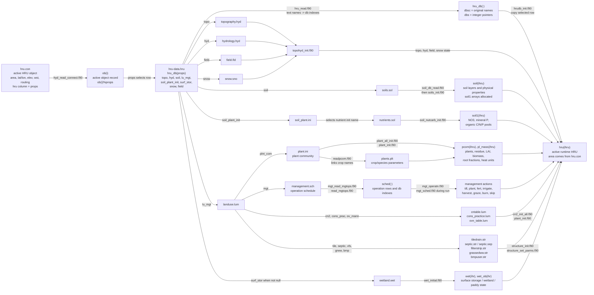
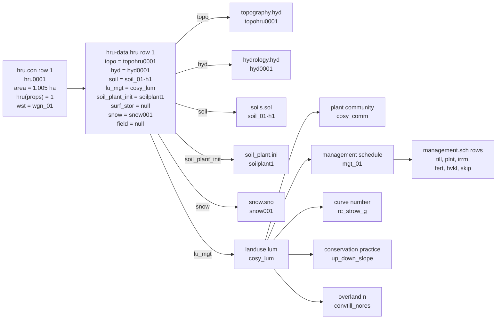

# HRU Property Reading Diagram

## Full HRU Property Flow

## Ames Sub1 Example

## How To Read The Diagram

- `hru.con` chooses the active object and its area, elevation, weather station,
  routing, and `props` pointer.
- `props` selects one row in `hru-data.hru`.
- `hru-data.hru` is mostly a bundle of names pointing to other input files.
- `lu_mgt` expands into plant community, management schedule, curve number,
  conservation practice, urban settings, and structural practices.
- Soil physical layers come from `soils.sol`; initial nutrient/carbon pools are
  initialized later through `soil_plant.ini` and `nutrients.sol`.

