# Spatial Object Property Reading Diagrams

This note maps each SWAT+ spatial object from `object.cnt` and its connect file
to the object-specific property files and runtime arrays.

The important split is:

- `object.cnt` gives counts by object type.
- `hyd_connect.f90` assigns each type a global range in `ob(:)`.
- Most `*.con` files are read by `hyd_read_connect.f90` into `ob(:)`.
- Object-specific readers later use `ob()%props`, `ob()%num`, or the local
  object number to choose the actual property data.

## Common Connect Shell

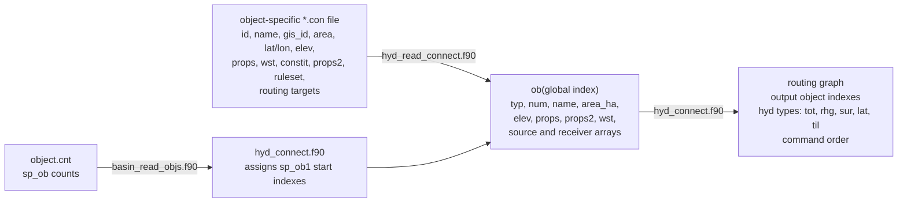

## Object Summary

| `object.cnt` field | Runtime object type | Output-link keyword | Connect file | Main property path |
|---|---|---|---|---|
| `sp_ob%hru` | `hru` | `hru` | [[hru.con]] | `ob()%props` selects [[hru-data.hru]], which expands to soil, landuse-management, plant community, management schedule, field, snow, and structural databases. See [[hru-property-reading-map]]. |
| `sp_ob%hru_lte` | `hru_lte` | `hlt` | [[hru-lte.con]] | `ob()%props` selects [[hru-lte.hru]]; that row crosswalks to [[plants.plt]], [[lum.dtl]], and [[soils_lte.sol]]. |
| `sp_ob%ru` | `ru` | `ru` | [[rout_unit.con]] | [[rout_unit.rtu]] reads `ru(:)` by local RU number; [[rout_unit.ele]] and [[rout_unit.def]] define member objects and fractions. |
| `sp_ob%gwflow` | `gwflow` | `gwflow` | [[gwflow.con]] | `gwflow_chan_read.f90` reads `chancell.gw`; `gwflow_read.f90` reads grid, cell, zone, HRU/LSU-cell, channel-cell, canal, pump, pond, and output files. |
| `sp_ob%aqu` | `aqu` | `aqu` | [[aquifer.con]] | `ob()%props` selects [[aquifer.aqu]] and initializes `aqu_dat(:)`, `aqu_prm(:)`, and aquifer state. |
| `sp_ob%chan` | `chan` | `cha` | [[channel.con]] | `ob()%props` selects [[channel.cha]], which crosswalks to [[initial.cha]], [[hydrology.cha]], [[sediment.cha]], and [[nutrients.cha]]. |
| `sp_ob%res` | `res` | `res` | [[reservoir.con]] | `ob()%props` selects [[reservoir.res]], which crosswalks to initial, hydrology, release, sediment, nutrient, salt, and constituent reservoir databases. |
| `sp_ob%recall` | `recall` | `recall` | [[recall.con]] | Runtime command uses `ob()%num` to index `recall(:)` and `recall_db(:)`; [[recall_db.rec]] names the time-series files. |
| `sp_ob%exco` | `exco` | `exc` | [[exco.con]] | `ob()%props` selects [[exco.exc]] for optional pest/path/metal/salt hydrographs. In this source branch, the organic-mineral assignment in `exco_read_om.f90` is commented out. |
| `sp_ob%dr` | `dr` | `dr` | [[delratio.con]] | `ob()%props` selects [[delratio.del]], then organic-mineral and optional constituent ratio files; command applies `dr(ob()%props)` to the incoming hydrograph. |
| `sp_ob%outlet` | `outlet` | `out` | [[outlet.con]] | No separate property database in this path; it passes incoming hydrograph to an outlet object. |
| `sp_ob%chandeg` | `chandeg` | `sdc` | [[chandeg.con]] | `ob()%props` selects [[channel-lte.cha]], which crosswalks to [[initial.cha]], [[hyd-sed-lte.cha]], [[sed_nut.cha]], and [[nutrients.cha]]. |
| `sp_ob%canal` | not a normal `hyd_read_connect` object here | water-allocation object | none in `hyd_connect.f90` | Count range is assigned, but canal data are read through [[water_canal.wal]] and GWFLOW canal files. |
| `sp_ob%pump` | not a normal `hyd_read_connect` object here | water-allocation conveyance | none in `hyd_connect.f90` | Count range is assigned, but pump behavior is handled through water-allocation transfer logic and GWFLOW pump files such as [[hru_pump.gw]] and [[pumpex.gw]]. |
| `sp_ob%aqu2d` | not currently used as a separate object | none | [[aquifer2d.con]] | `object.cnt` marks it not currently used; `aqu2d_read` and `aqu2d_init` are called from aquifer/channel setup, not through a separate `sp_ob%aqu2d` command range. |
| `sp_ob%herd` | not currently used | none | none | Count field exists in `object.cnt`, but no normal spatial-object connect path is used in `hyd_connect.f90`. |
| `sp_ob%wro` | not currently used | none | none | Count field exists in `object.cnt`, but no normal spatial-object connect path is used in `hyd_connect.f90`. |

## HRU

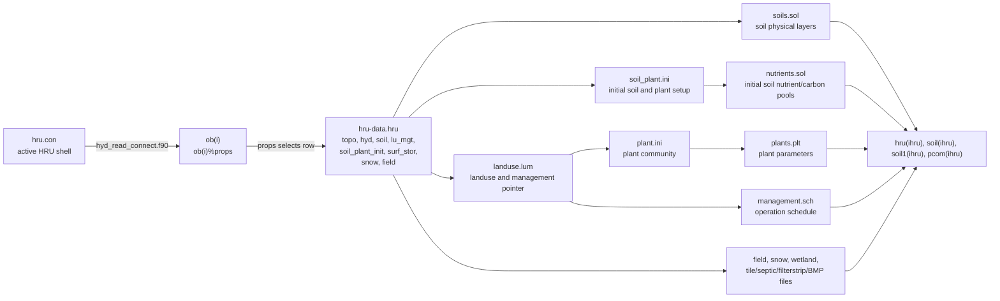

See [[hru-property-reading-map]] for the detailed HRU-only diagram.

## HRU-LTE

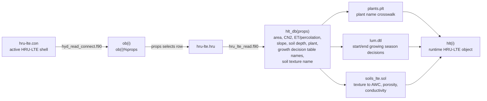

## Routing Unit

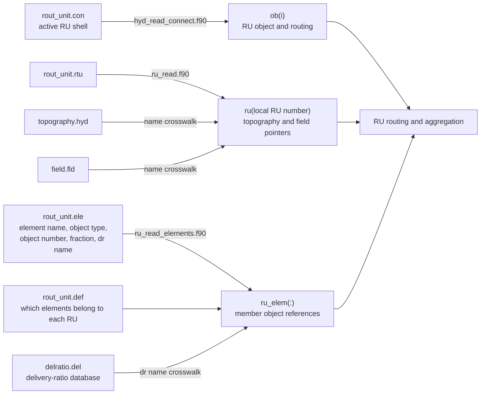

For RU, the connect file defines the active RU object and routing shell. The
`rout_unit.rtu` file fills `ru(:)` by local RU number rather than through a
separate `ru_db(props)` array.

## Aquifer

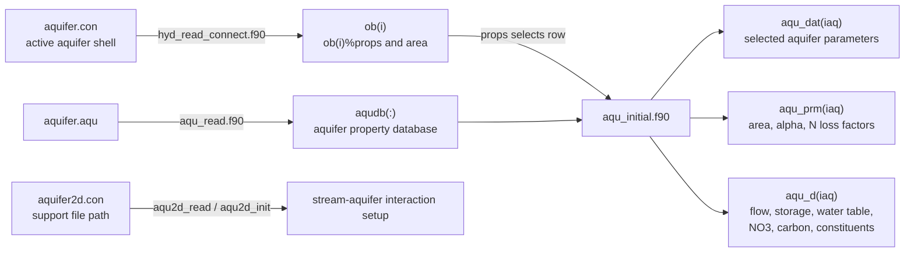

## Regular Channel

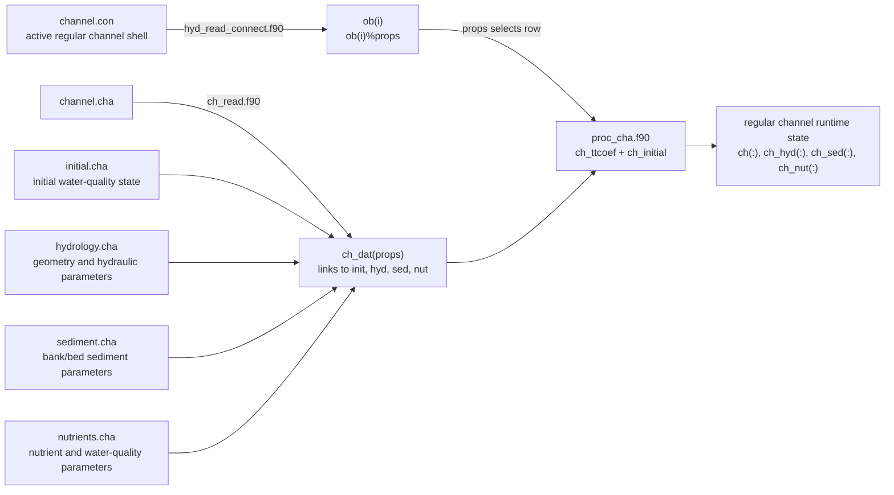

Regular channels use `sp_ob%chan`, runtime type `chan`, and output-link keyword
`cha`.

## SWAT-DEG Channel

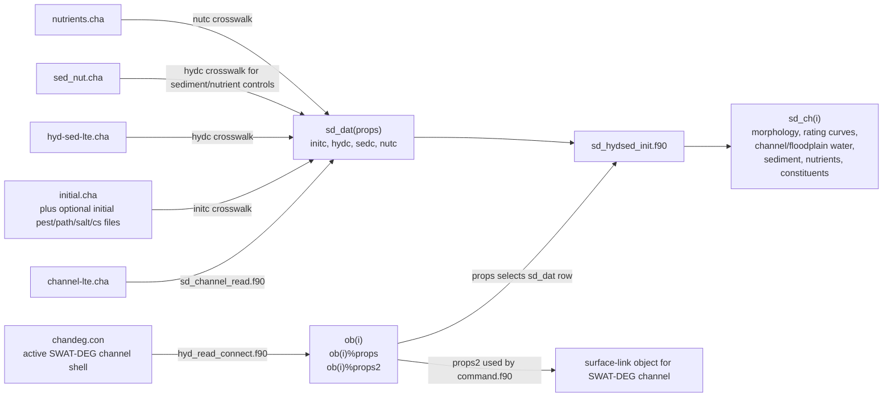

SWAT-DEG channels use `sp_ob%chandeg`, runtime type `chandeg`, and output-link
keyword `sdc`. In `command.f90`, `ob(icmd)%num` is the SWAT-DEG channel number
and `ob(icmd)%props2` is also used during SWAT-DEG channel control.

## Reservoir

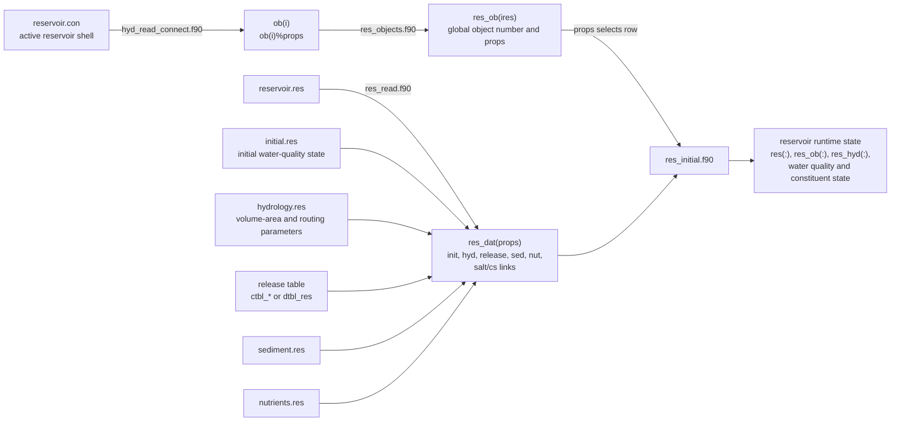

## Recall, Export Coefficient, Delivery Ratio, Outlet

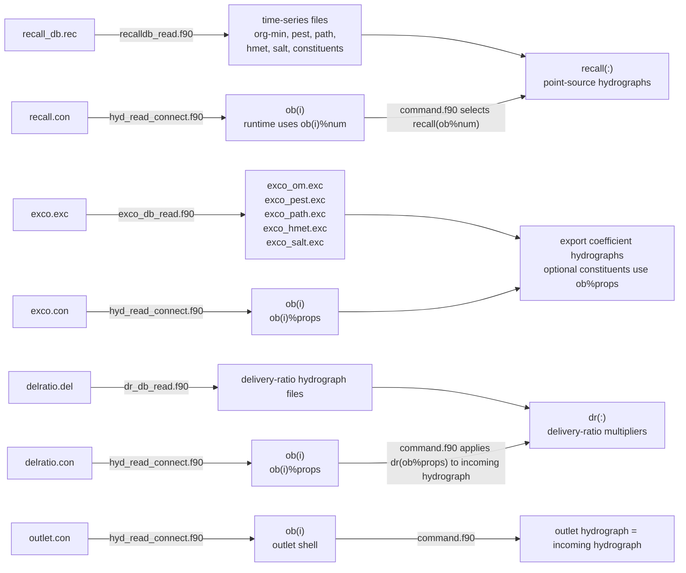

## GWFLOW

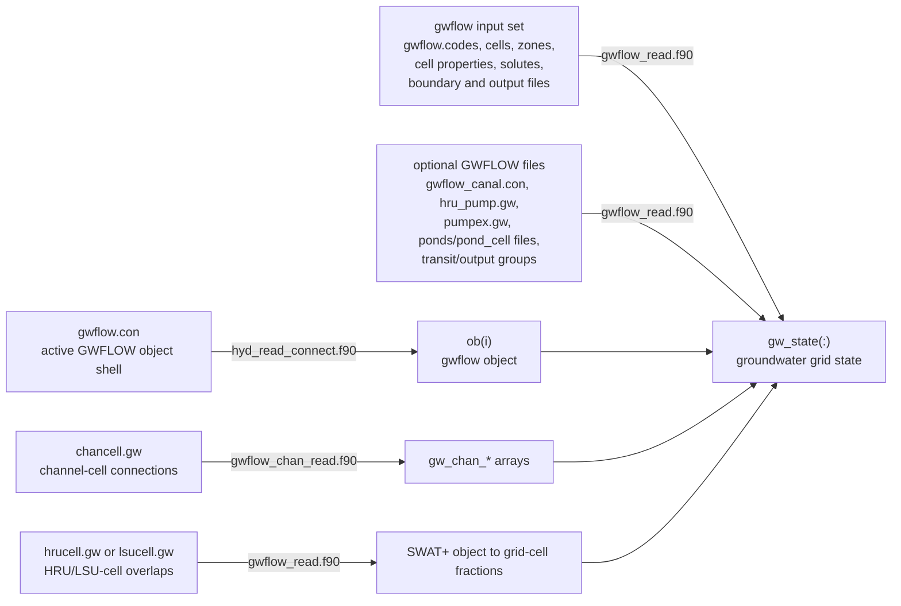

In this branch, `gwflow_chan_read.f90` uses `sp_ob%gwflow` as the number of
channel-cell connection rows. GWFLOW is therefore more like a grid subsystem
attached to SWAT+ objects than a simple single-row property database.

## Canal, Pump, Aquifer2D, Herd, Water Rights

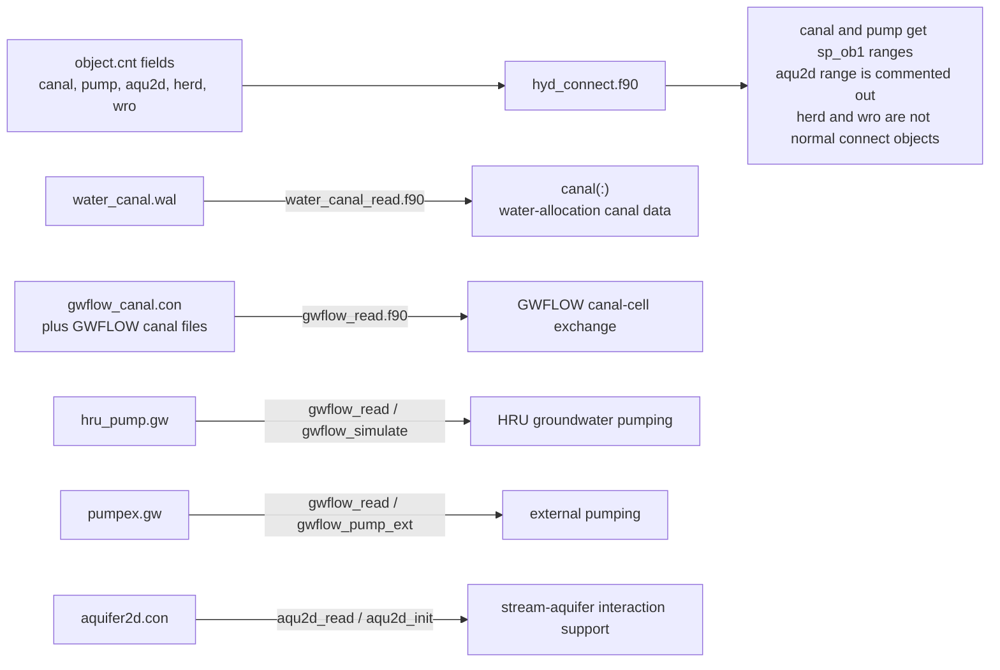

These fields are included in `object.cnt`, but they are not all equivalent to
the normal `*.con -> hyd_read_connect -> ob()%props -> property database` pattern.
For this source branch:

- `canal` is mainly read from `water_canal.wal` and GWFLOW canal files.
- `pump` appears through water-allocation conveyance and GWFLOW pump files.
- `aqu2d` is marked not currently used as its own spatial-object count, although
  `aqu2d_read` and `aqu2d_init` are still called in the aquifer/channel setup.
- `herd` and `wro` are count fields with no normal spatial-object reader path in
  `hyd_connect.f90`.

## Source Routine Anchors

- [[object.cnt]] is read by [[basin_read_objs.f90]].
- [[hyd_connect.f90]] assigns `sp_ob1` ranges and calls `hyd_read_connect.f90`.
- [[hyd_read_connect.f90]] reads most spatial-object connect files into `ob(:)`.
- [[main.f90]] calls `hyd_connect`, then recall, exco, delivery ratio, HRU,
  channel, aquifer, HRU-LTE, canal, reservoir, and output setup routines.
- [[command.f90]] executes the routed objects during simulation.
