# 调用关系图

## 主程序 main 的直接调用

```mermaid
graph LR
  main["main<br/>main.f90"]
  main --> proc_bsn["proc_bsn"]
  main --> proc_date_time["proc_date_time"]
  main --> proc_db["proc_db"]
  main --> proc_read["proc_read"]
  main --> hyd_connect["hyd_connect"]
  main --> recalldb_read["recalldb_read"]
  main --> exco_db_read["exco_db_read"]
  main --> dr_db_read["dr_db_read"]
  main --> cli_lapse["cli_lapse"]
  main --> object_read_output["object_read_output"]
  main --> om_water_init["om_water_init"]
  main --> pest_cha_res_read["pest_cha_res_read"]
  main --> path_cha_res_read["path_cha_res_read"]
  main --> salt_cha_read["salt_cha_read"]
  main --> cs_cha_read["cs_cha_read"]
  main --> lsu_read_elements["lsu_read_elements"]
  main --> proc_hru["proc_hru"]
  main --> proc_cha["proc_cha"]
  main --> proc_aqu["proc_aqu"]
  main --> dtbl_lum_read["dtbl_lum_read"]
  main --> hru_lte_read["hru_lte_read"]
  main --> proc_cond["proc_cond"]
  main --> res_read_weir["res_read_weir"]
  main --> dtbl_res_read["dtbl_res_read"]
  main --> dtbl_scen_read["dtbl_scen_read"]
  main --> cal_cond_read["cal_cond_read"]
  main --> manure_allocation_read["manure_allocation_read"]
  main --> dtbl_flocon_read["dtbl_flocon_read"]
  main --> om_treat_read["om_treat_read"]
  main --> om_use_read["om_use_read"]
  main --> om_osrc_read["om_osrc_read"]
  main --> water_treatment_read["water_treatment_read"]
  main --> water_use_read["water_use_read"]
  main --> water_tower_read["water_tower_read"]
  main --> water_pipe_read["water_pipe_read"]
  main --> water_canal_read["water_canal_read"]
  main --> water_allocation_read["water_allocation_read"]
  main --> hru_dtbl_actions_init["hru_dtbl_actions_init"]
  main --> proc_res["proc_res"]
  main --> wet_read_hyd["wet_read_hyd"]
  main --> wet_read["wet_read"]
  main --> wet_read_salt_cs["wet_read_salt_cs"]
  main --> wet_all_initial["wet_all_initial"]
  main --> wet_fp_init["wet_fp_init"]
  main --> proc_cal["proc_cal"]
  main --> soil_nutcarb_init["soil_nutcarb_init"]
  main --> proc_open["proc_open"]
  main --> unit_hyd_ru_hru["unit_hyd_ru_hru"]
  main --> dr_ru["dr_ru"]
  main --> hyd_connect_out["hyd_connect_out"]
  main --> command["command"]
  main --> time_control["time_control"]
  main --> calsoft_control["calsoft_control"]
  main --> cal_parmchg_read["cal_parmchg_read"]
  main --> calhard_control["calhard_control"]
  main --> swift_output["swift_output"]
  main --> date_and_time["date_and_time"]
```



> 完整调用关系：每篇源码笔记的「调用关系」section 都有正向调用列表 + dataview 实时反查「被谁调用」。

## 调用热度排行（被调用最多的子程序 = 核心枢纽）

```dataviewjs
const pages = dv.pages('"10-19 科研/00-课题/14 - SWAT/SWATPLUS/01-源码程序"').where(p => p.calls);
const counter = {};
for (const p of pages) {
  for (const c of p.calls) { counter[c] = (counter[c] || 0) + 1; }
}
const rows = Object.entries(counter)
  .sort((a,b) => b[1]-a[1])
  .slice(0, 30)
  .map(([name, n]) => [name + ".f90", n]);
dv.table(["被调用子程序", "调用方数量"], rows);
```

## 按子程序查调用方

在任一源码笔记里，下面的查询会列出调用它的所有程序（`this.subroutine` 自动取当前笔记）：

```
```dataview
LIST file.link
WHERE type = "source" AND contains(calls, this.subroutine)
``` ```
