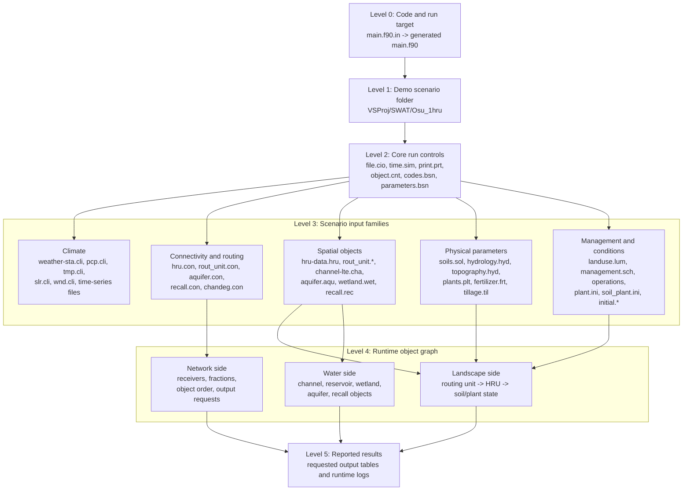
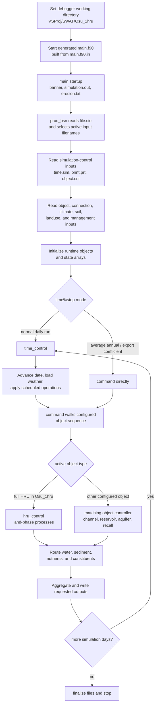

# SWAT+ Model Structure

This guide is the short map of which part of the code does what. It is an orientation layer; use the linked topic notes when you need exact evidence.

## Top-Level Shape

```text
main.f90.in -> generated Visual Studio main.f90
    -> input and object initialization
    -> time_control
        -> daily calendar and climate work
        -> command
            -> object dispatch
            -> object/process outputs
```

The maintained program entry is [`main.f90.in`](../SWATPLUS/swatplus/src/main.f90.in). The Visual Studio project compiles ignored local output `VSProj/SWAT/generated/main.f90`, generated from the template by [`generate-main.ps1`](../VSProj/SWAT/generated/generate-main.ps1). The generated file is not the durable edit target.

At startup, `main` writes the program banner to the console and `simulation.out`, opens `erosion.txt`, then calls `proc_bsn`, which begins the `file.cio` input-selection path.

## Demo Structural Levels Figure

This figure is a static level map for the [`Osu_1hru`](topics/osu-1hru-scenario.md) demo. It is not a procedure or call-order diagram; read it as "what level contains or configures what."



Use this hierarchy when you need to decide whether a file defines the whole run, selects an input family, defines an object, supplies parameters for an object, initializes state, or controls reported results.

## Demo Procedure Diagram

Use this procedure for the small [`Osu_1hru`](topics/osu-1hru-scenario.md) demo when learning the runtime structure in the Visual Studio debugger.



The demo is useful because its object count is small enough to watch the transition from `file.cio` selection into `time_control`, `command`, and the active HRU controller. It does not prove optional object paths unless the selecting inputs enable those objects in the scenario.

## Major Responsibilities

| Area | Main files | Responsibility |
| --- | --- | --- |
| Program lifecycle | [`main.f90.in`](../SWATPLUS/swatplus/src/main.f90.in) | Startup, input/object initialization, run-mode branch, shutdown. |
| Calendar and daily orchestration | [`time_control.f90`](../SWATPLUS/swatplus/src/time_control.f90) | Simulation dates, daily initialization, climate handling, scheduled actions, call into command execution. |
| Object dispatch | [`command.f90`](../SWATPLUS/swatplus/src/command.f90) | Walk the configured command/object sequence and call the selected object controller. |
| Full HRU controller | [`hru_control.f90`](../SWATPLUS/swatplus/src/hru_control.f90) | Enter the detailed land-phase path for a configured full HRU. |
| Input selection | [`readcio_read.f90`](../SWATPLUS/swatplus/src/readcio_read.f90), [`input_file_module.f90`](../SWATPLUS/swatplus/src/input_file_module.f90) | Read `file.cio` and store filenames used by downstream readers. This path is only partially traced. |
| External source discovery | [`topics/deepwiki-swatplus.md`](topics/deepwiki-swatplus.md) | Use DeepWiki to find candidate files, then verify locally. |

## Important Branches

In a normal time-stepped run, `main` calls `time_control`. If `time%step < 0`, `main` takes the average-annual/export-coefficient path and calls `command` directly. This explains why a `time_control` breakpoint may not be reached in that special mode.

Inside `command`, the active route depends on scenario object definitions, connection files, object types, command order, and model options. Seeing a routine in `command.f90` does not prove a scenario executes it.

## Alternative Object Representations

Some object types represent the same broad physical system with different model detail:

| Physical system | Simpler / lumped representation | Detailed / stronger representation |
| --- | --- | --- |
| Land unit | `hru_lte` / `hlt` | `hru` |
| Stream channel | `cha` | `sdc` / SWAT-DEG channel |
| Groundwater / aquifer | `aqu` | `gwflow` |

The first two pairs are strong direct comparisons. The groundwater pair is useful but less exact because `gwflow` is not always a direct one-to-one replacement for every `aqu` setup. Details and caveats are in [`topics/alternative-object-representations.md`](topics/alternative-object-representations.md).

## How To Read A Code Path

For a new behavior, start broad and then narrow:

1. Identify the input or option that selects the behavior.
2. Find the reader and the storage field.
3. Confirm the controlling object type and index.
4. Step through `time_control` and `command` only until the active object controller is known.
5. Move into the smallest process routine that owns the equation or state transition.
6. Follow downstream routing, aggregation, and output.

The detailed control-flow evidence is in [`topics/simulation-control-flow.md`](topics/simulation-control-flow.md). Main-program generation details are in [`topics/main-program-generation.md`](topics/main-program-generation.md).
